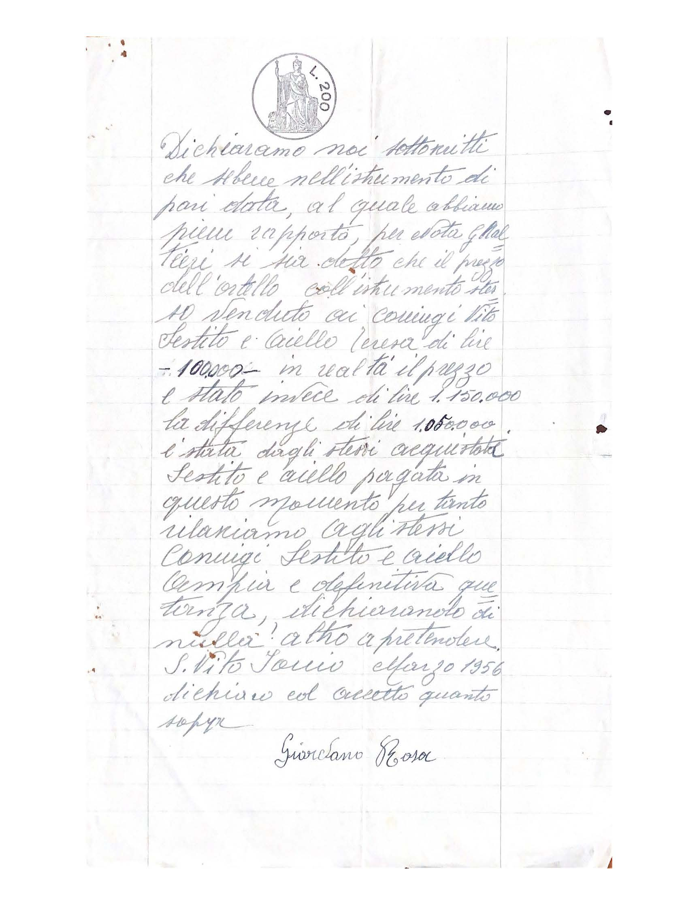

[Prima parte](/1955/12/26/acquisto-terreno-cinema-in-via-comm-doria/)

[Acquisto terreno orto cinema](/1956/04/07/acquisto-orto-cinema-in-via-comm-doria/)

Dichiariamo noi sottoscritti che sebbene nell’istrumento di pari data, al quale abbiamo pieno rapporto, per ... se sia detto che il prezzo dell’ortello coll’istrumento stesso venduto ai coniugi Vito Sestio e Aiello Teresa di lire 100'000 in realtà il prezzo e stato invece di lire 1'150'000 la differenza di lire 1'050'000 è stata dagli stessi acquirenti Sestito e Aiello pagata in questo momento per tanto rilasciamo agli stessi coniugi Sestito e Aiello ampia e definitiva quietanza, dichiarando di null’altro a pretendere.

S. Vito Jonio Marzo 1956 dichiaro corretto quando sopra.

Giordano Rosa