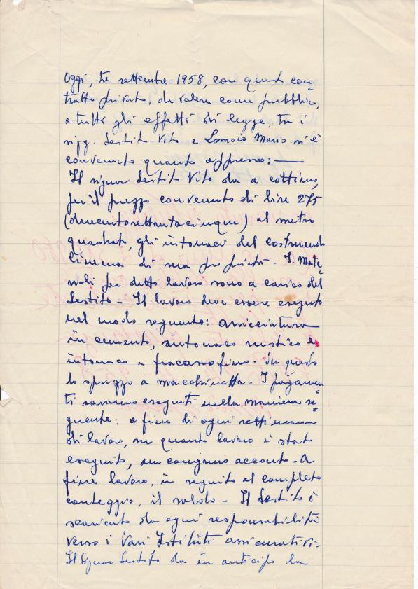
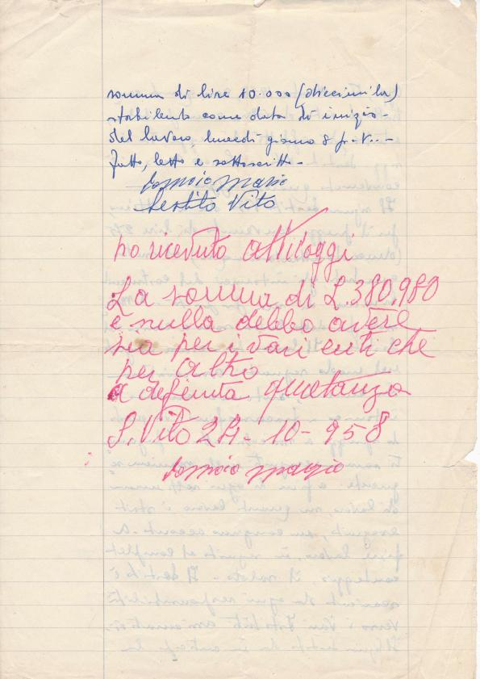

Oggi, tre settembre 1958, con questo contratto privato, da valore come pubblico, a tutti gli effetti di legge, tra i sigg. Sestito Vito e Lomoio Mario si è convenuto quanto appresso:  
Il signor Sestito Vito da a cottimo, per il prezzo convenuto di lire 275 (duecentosettantacinque) al metro quadrato, gli intonaci del costruendo cinema di sua proprietà. I materiali per detto lavoro sono a carico del Sestito. Il lavoro deve essere eseguito nel modo seguente: … in cemento, intonaco rustico e intonaco a fracasso fino. Sia questo da spruzzo a macchinetta. I pagamenti saranno eseguiti nella maniera seguente: a fine di ogni settimana di lavoro, su quanto lavoro è stato eseguito, un … acconto. A fine lavoro, in seguito al completo conteggio, il saldo. Il Sestito è scaricato da ogni responsabilità verso i vani istituiti assicurativi. Il Signor Sestito da in anticipo la somma di lire 10.000 (diecimila) stabilendo come data di impiego del lavoro lunedì giorno 8 p. v.

Fatto, letto e sottoscritto.

Lomoio Mario  
Sestito Vito

Ho ricevuto oggi la somma di L. 380.980 e nulla debbo avere sia per i vari enti che per altro a definita quietanza  
S. Vito 24-10-1958  
Lomoio Mario