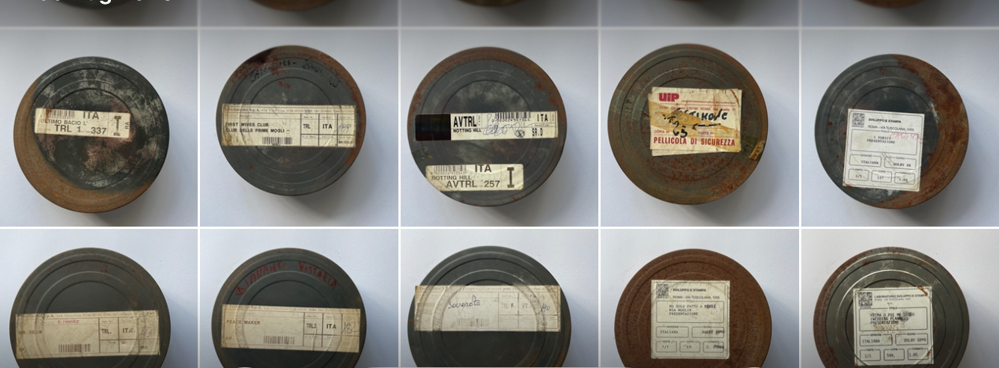

## Introduzione

Tra i materiali tecnici conservati nell’archivio, le **bobine dei trailer cinematografici** rappresentano una testimonianza di grande valore storico e materiale. Si tratta di piccoli rulli in pellicola **35mm**, inviati periodicamente dalle **case di distribuzione** ai cinema italiani per la promozione dei film in uscita.

Le bobine, generalmente lunghe pochi metri, contenevano una selezione di sequenze montate ad hoc per stimolare l’interesse del pubblico. Erano proiettate **prima della proiezione principale**, in genere assieme ai cinegiornali o ad altri annunci pubblicitari locali.

## Funzione e contesto d’uso

Durante la seconda metà del Novecento, la circolazione dei trailer costituiva un elemento centrale della **filiera distributiva**. I distributori, spesso corrispondenti delle grandi major americane o di società italiane come la **Metro-Goldwyn-Mayer**, la **Titanus** o la **Cineriz**, inviavano ai gestori di sala le copie promozionali tramite posta o corriere.

Queste venivano poi **restituite o riutilizzate**: in alcuni casi montate in rulli multipli, in altri catalogate e conservate a discrezione dell’esercente. Il Cinema Sestito ne ha mantenuto un numero significativo, costituendo oggi un raro esempio di **archivio tecnico-cinematografico** legato all’attività ordinaria di una sala di provincia.

## Descrizione delle bobine

Le bobine si presentano in **contenitori metallici o di plastica**, ciascuno recante un’etichetta originale con le seguenti informazioni:

- titolo del film;  
- casa di distribuzione;  
- numero identificativo di copia;  
- eventuali note logistiche (es. “Trailer 1° parte”, “Versione italiana”, “Colore”).  

Le etichette, spesso scritte a macchina o con timbro tipografico, costituiscono un importante documento in sé, utile a ricostruire le **reti distributive** e le pratiche amministrative del settore.

