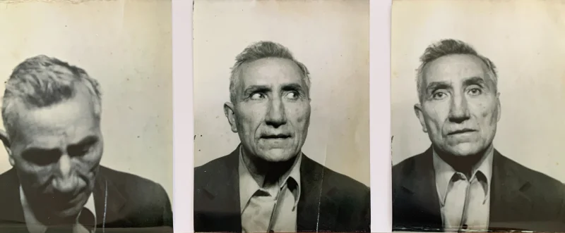

## Un artigiano visionario

Vito Sestito nacque a San Vito sullo Ionio il 12 novembre 1902, ultimo di cinque figli. Le fonti disponibili restituiscono solo frammenti della sua infanzia: si sa che completò la terza elementare[^1] e che, ancora giovanissimo, intraprese il mestiere di falegname.

Nel 1921, a 19 anni, fu arruolato nel servizio di leva e congedato due anni più tardi[^2]. Tornato a San Vito, riprese il lavoro artigianale, e la sua figura emerge per la prima volta in una cartolina fotografica del 1924, che lo ritrae col cappello in piedi al centro di un gruppo di amici.



## Ricostruzione e nascita del cinema

Nel secondo dopoguerra, Vito si dedicò alla ricostruzione materiale del paese, riaprendo la falegnameria e contribuendo al ripristino degli edifici danneggiati. Fu in questo contesto che, collaborando come artigiano con il cinema Masceri di Catanzaro, maturò l’idea di fondare una sala cinematografica a San Vito[^3].

Il *Cinema Sestito* nacque come risposta a un bisogno collettivo: offrire uno spazio di svago, cultura e socializzazione in un territorio privo di strutture simili. La sala divenne rapidamente un punto di riferimento per la comunità locale e per i paesi limitrofi, ospitando proiezioni di ogni genere e contribuendo alla diffusione della cultura cinematografica.

Parallelamente, Vito continuò a esercitare la falegnameria fino a quando un’allergia al legno lo costrinse ad abbandonare la professione. Nel 1961 avviò un’attività di vendita di ricambi per cicli, motocicli e automobili[^4], anticipando l’espansione del mercato automobilistico in Calabria.

## Diari e memoria documentaria

Figura di grande disciplina e precisione, Vito Sestito ha lasciato una vasta produzione documentaria: diari manoscritti, contratti e agende cinematografiche. Questi materiali, rinvenuti durante una ricerca archivistica condotta nel suo ex negozio, costituiscono una fonte preziosa per lo studio della sua attività imprenditoriale e culturale.

Particolarmente rilevanti sono le agende dedicate alla programmazione del cinema[^5], nelle quali annotava meticolosamente titoli, date, case di distribuzione e incassi. Tali registrazioni offrono uno spaccato dettagliato della gestione della sala e della sua evoluzione nel tempo.

## Una vita intrecciata con la comunità

I diari coprono un arco temporale ampio, dal 1936 al 1949[^6], e documentano le complesse reti di scambio economico e sociale attivate da Vito: prestiti familiari, investimenti immobiliari, compravendita di beni agricoli e gestione di attività parallele. Tra le operazioni più significative figura l’acquisto di un immobile in Piazza Mario Polerà[^7], segnalato come strategico per lo sviluppo locale.

L’analisi dei registri rivela una netta distinzione tra le diverse attività economiche, ma anche una forte interconnessione tra esse, che restituisce un quadro articolato della vita quotidiana e dell’imprenditoria di provincia nel secondo dopoguerra.

## Eredità e riconoscimento

La figura di Vito Sestito emerge come emblematica di una generazione che ha affrontato le difficoltà della guerra e della ricostruzione con determinazione e spirito di iniziativa. Il suo lascito - costituito dal cinema, dal negozio di ricambi e dalla documentazione personale - rappresenta una risorsa culturale e storica per la comunità di San Vito sullo Ionio.

Questo sito web intende valorizzare tale eredità, offrendo uno spazio di ricerca e di memoria dedicato a una storia locale che merita di essere conosciuta, studiata e tramandata.

[^1]: Attestato terza elementare. San Vito sullo Ionio. 1915. [Link al documento](/1915/08/20/attestato-scuola-elementare-vito-sestito/)
[^2]: Foglio di Congedo Illimitato. Catanzaro. 1923. [Link al documento](/1923/10/09/congedo-fine-leva-vito-sestito/)
[^3]: [Articolo](/2023/04/27/la-nascita-del-cinema-a-san-vito-un-sogno-diventato-realt/) sulle origini del cinema  
[^4]: Attestato d'esercizio ricambi. San Vito sullo Ionio. 1961. [Link al documento](/1961/08/01/attestato-d-eserzizio-ricambi-in-pizza-mario-poler/)
[^5]: [Link](/programmazione-storica/fonti/) alla sezione sulle fonti della programmazione cinematografica
[^6]: Diario di Vito dal 1936 al 1949. San Vito sullo Ionio. [Link al documento](/1936/02/01/diario-vito-sestito-dal-1936-al-1949/)
[^7]: [Link](/categories/proprietà/) all'archivio sulle proprietà relative al cinema.