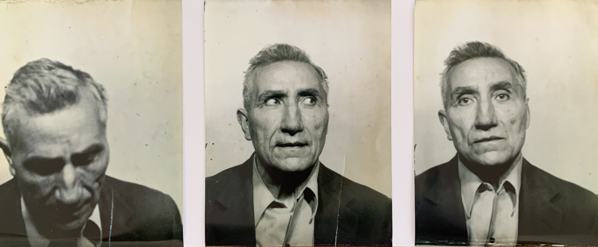
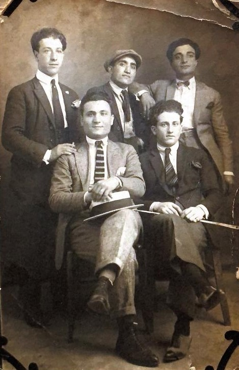
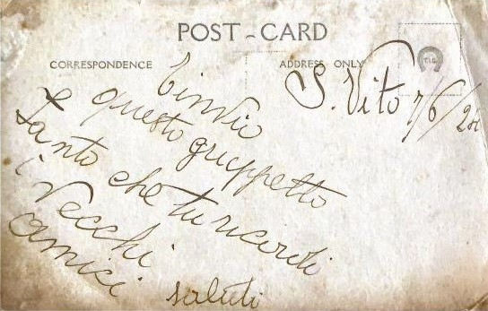
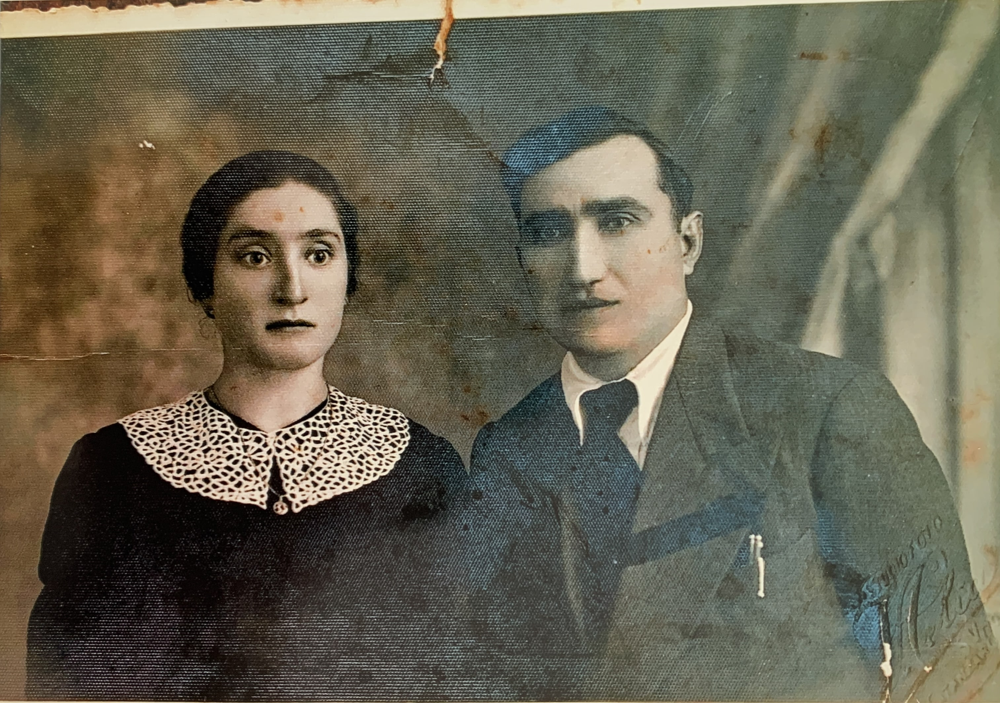

## Dalla falegnameria al cinema

Mio Nonno nasce a San Vito sullo Ionio il 12 novembre del 1902 da Vito Sestito e Teresa Zurzolo. Ultimo di cinque figli, gran parte della sua infanzia rimane un mistero. Dalle poche fonti dell’epoca ho scoperto che ha completato la terza elementare[^1], e che ad un certo punto iniziò a lavorare come falegname.

Nel settembre del 1921 a 19 anni viene arruolato nel servizio di leva dell’esercito. Congedato due anni più tardi il 9 ottobre 1923 rientra a San Vito e continua a lavorare come falegname[^2].

La prima foto del nonno proviene da una cartolina del 7 giugno 1924, Vito si trova in piedi al centro col cappello.

 &nbsp;&nbsp;&nbsp;&nbsp;

Il 24 gennaio del 1931 si sposa con Maria Vitrò, ma la moglie muore durante il concepimento del loro primo figlio. Nel 1939 si risposa con mia nonna Teresa Aiello. Poco dopo il matrimonio scoppia la Seconda Guerra Mondiale e Vito viene richiamato a servire nell'esercito italiano ed inviato in Libia.

Teresa e Vito  

Foto di Vito scattata in Libia  

Quando Vito torna a casa era determinato ad aiutare la sua comunità a riprendersi dalla devastazione del dopoguerra. Riapre la falegnameria e inizia a lavorare sulla ricostruzione di mobili e finestre danneggiati dalla guerra.

Per pura coincidenza, presta i suoi servizi di falegname per conto del proprietario del cinema Masceri a Catanzaro. Questa esperienza gli dà l'idea di costruire un cinema nel suo paese. Il cinema di mio nonno diviene un luogo di ritrovo popolare per persone di tutte le età a San Vito e nei paesi vicini, fornendo loro un luogo dove rilassarsi e godersi i film[^3].

Per un po’ di tempo, continua a lavorare come falegname mentre gestiva il cinema. Tuttavia, negli anni successivi Vito contrae un'allergia al legno che lo costringe ad abbandonare la sua professione originale.

Durante questo periodo Vito avvia una nuova attività di vendita di pezzi di ricambio per ciclo e motociclo, e successivamente per auto. Il suo negozio apre il primo di agosto del 1961[^4]. Anche se a quel tempo circolavano poche automobili in paese, con l’aumentare delle vetture in circolazione, il punto vendita ebbe molto successo.

Mio nonno era un uomo di profonda disciplina e meticolosità. Durante la sua vita, ha mantenuto una serie di diari scritti a mano, nei quali annotava minuziosamente ogni dettaglio della sua esistenza, dalle transazioni commerciali alla gestione dei prestiti per i suoi investimenti. Sono venuto a conoscenza di questa parte della sua vita recentemente, durante la ricerca di documenti per scrivere questa serie di articoli sulla storia del cinema di famiglia, ho scoperto casualmente questi preziosi diari nascosti sotto pile di cataloghi vecchi nel suo negozio di ricambi.

Ciò che più ha catturato la mia attenzione sono stati i suoi archivi delle programmazioni cinematografiche[^5]. In quelle agende, mio nonno aveva diligentemente documentato ogni singola proiezione tenutasi presso il cinema, registrando scrupolosamente le date, il catalogo delle pellicole, le case di distribuzione coinvolte e il numero di biglietti venduti. Questa scoperta è stata un vero e proprio tesoro, poiché ha gettato una luce nuova sulla storia del nostro cinema locale e sulla passione di mio nonno per la settima arte.

Nonostante non avessi mai avuto l'opportunità di fargli molte domande dirette, poiché è scomparso prima della mia nascita, mi sento oggi più vicino a lui attraverso questa straordinaria eredità. Ho ereditato non solo il suo amore per la tenacia e la precisione, ma anche la sua passione per la documentazione e i dati. Questo sito web è, in un certo senso, un viaggio di scoperta per saperne di più su di lui, sulle sue motivazioni, i suoi sogni e le sue speranze.

Spesso diamo per scontato la nostra capacità di monitorare le spese con un semplice tocco su uno smartphone o di consultare online la documentazione della nostra banca. Ciò che mio nonno faceva potrebbe sembrare eccessivo in confronto. Senza l'ausilio di moderni strumenti digitali, lui si affidava esclusivamente a carta e penna, e questa era una parte vitale della sua routine giornaliera.

In uno dei suoi diari, che copre il periodo dal 1936 al 1949[^6] emergono chiaramente le complesse reti di relazioni familiari e comunitarie. Mio nonno prestava denaro ai parenti e ai concittadini, e allo stesso modo, chiedeva prestiti per finanziare progetti di vario genere. Tra i prestiti più significativi che ricevette spiccano quelli destinati all'acquisto del palazzo in Piazza Mario Polerà (pagina 26-27), una testimonianza tangibile del suo impegno nella crescita della nostra comunità.

I diari rivelano le sfaccettate attività economiche di mio nonno, che spaziavano dall'acquisto e vendita di bestiame, vino e olio, fino al suo lavoro di falegname e alla gestione del cinema. E anche se le informazioni trovate suggeriscono che teneva registri di spese separati per le diverse attività, è affascinante constatare come queste diverse sfere della sua vita si intersecassero, creando una storia intricata e ricca di dettagli.

Mio nonno, attraverso i suoi diari, ci ha regalato un affascinante viaggio nel passato, una finestra aperta su una vita segnata dalla dedizione al lavoro, all'amore per la comunità e alla passione per il cinema.

Il lascito di Vito vive ancora a San Vito, sia il cinema che il negozio di ricambi rimangono una pietra miliare della cultura e della storia del paesello. La storia di mio nonno è la testimonianza di una generazione che ha dovuto affrontare le difficoltà della guerra e della ricostruzione. La sua perseveranza e la sua determinazione sono un esempio di coraggio e di resilienza per le generazioni future. È un onore per me condividere queste scoperte con voi e continuare a celebrare il suo lascito e la storia unica del nostro cinema.

[^1]: Attestato terza elementare. San Vito sullo Ionio. 1915. [Link al documento](/1915/08/20/attestato-scuola-elementare-vito-sestito/)
[^2]: Folgio di Congedo Illimitato. Catanzaro. 1923. [Link al documento](/1923/10/09/congedo-fine-leva-vito-sestito/)
[^3]: Se vuoi saperne di più sulle origini del cinema leggi questo [articolo](/2023/04/27/la-nascita-del-cinema-a-san-vito-un-sogno-diventato-realt/)
[^4]: Attestato d'esercizio di rimcabi. San Vito sullo Ionio. 1961. [Link al documento](/1961/08/01/attestato-d-eserzizio-ricambi-in-pizza-mario-poler/)
[^5]: [Link](/programmazione-cinematografica/) alla sezione sulle agende cinematografiche
[^6]: Diario di Vito dal 1939 al 1949. San Vito sullo Ionio. 1936. [Link al documento](/1936/02/01/diario-vito-sestito-dal-1936-al-1949/)