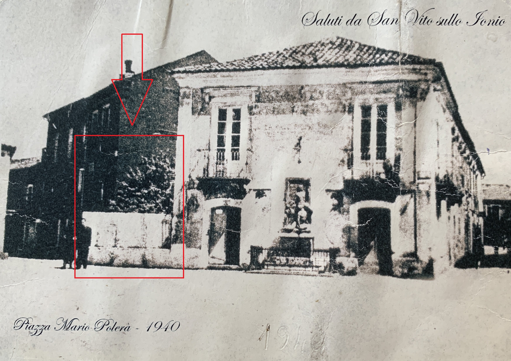

          

## Un sogno che diventa realtà

Il secondo dopoguerra rappresentò per l’Italia un periodo di ricostruzione materiale e simbolica, in cui il cinema assunse un ruolo centrale come forma di svago collettivo e veicolo di modernità. Anche a **San Vito sullo Ionio**, piccolo centro della Calabria jonica, la nascita di una sala cinematografica fu il segno tangibile di questa rinascita.

L’iniziativa si deve a **Vito Sestito**, artigiano e imprenditore locale, la cui passione per la settima arte nacque nel 1946 durante le proiezioni al **Cinema Masceri di Catanzaro**. Quelle esperienze, vissute in un contesto di entusiasmo postbellico, lo spinsero a immaginare un luogo simile nel proprio paese.
          
## Le origini del progetto[^1]
          
Negli anni immediatamente successivi alla guerra, molte famiglie catanzaresi rientrarono nelle loro abitazioni trovandole danneggiate o saccheggiate. Tale situazione generò una forte domanda di legname e di servizi di falegnameria. Fu proprio in questo contesto che Sestito, proprietario di una segheria, iniziò a collaborare con i gestori del **Cinema Masceri**. In segno di riconoscenza, questi ultimi lo invitarono alle proiezioni serali, esperienza che avrebbe segnato l’inizio della sua avventura cinematografica.

Rientrato a San Vito, Vito decise di offrire ai suoi concittadini la possibilità di condividere quella stessa emozione. Con l’aiuto della **famiglia Parentela** — soci del Teatro Masceri — e di alcuni proiezionisti catanzaresi, acquistò una **macchina da proiezione** e individuò il luogo ideale: un orto di sua proprietà in **Piazza Mario Polerà**, accanto alla sua abitazione[^2]. 

## La costruzione della sala

La realizzazione della sala richiese il consenso delle autorità comunali e dei Carabinieri locali, che accolsero il progetto con favore. Il **sindaco Ferdinando Migliaccio** e il **maresciallo Volenti**, comandante della stazione dei Carabinieri, offrirono il loro sostegno. Parte della segheria venne smantellata per creare l’ingresso degli spettatori, mentre l’orto fu interamente trasformato in sala cinematografica, con una capienza ridotta ma ingegnosa.

La struttura era suddivisa in quattro ambienti: ingresso, cabina di proiezione, palchetto e platea. Le sedie, costruite artigianalmente da Sestito, occupavano ogni spazio disponibile, lasciando solo un corridoio centrale. Dal **Cinema Masceri** giunse anche l’operatore **Oscar Pedullà**, incaricato di montare la macchina e di formare Vito e il fratello Vincenzo alla proiezione dei film.

## L’autorizzazione e i primi successi

Dopo diversi mesi di lavoro e burocrazia, il **19 marzo 1949** il prefetto di Catanzaro rilasciò a Vito Sestito l’autorizzazione ufficiale per gli spettacoli pubblici[^3]. L’inaugurazione del **Cinema di Piazza Mario Polerà** fu accolta con entusiasmo: la notizia si diffuse rapidamente nei paesi vicini, e la piccola sala non riusciva a contenere tutti gli spettatori. Si rese così necessario un **calendario d’ingresso per paese**, un sistema ingegnoso che dimostra la straordinaria partecipazione popolare.

Ogni proiezione era preceduta da brevi intermezzi musicali e da ["La Settimana Incom"](https://www.archivioluce.com/la-settimana-incom/), cinegiornale che diffondeva notizie di attualità e sport, simbolo della nuova Italia repubblicana.

 
          &nbsp;&nbsp;&nbsp;&nbsp;

## Le difficoltà della gestione

Gestire un cinema in un contesto rurale nel dopoguerra comportava notevoli difficoltà economiche e logistiche. Le attrezzature erano costose, spesso obsolete, e la manutenzione richiedeva competenze tecniche non comuni. Inoltre, la disponibilità economica delle famiglie era limitata, e non mancavano casi di accessi gratuiti concessi agli amici del proprietario.

Nel 1955 i **Carabinieri di San Vito** redassero un **processo verbale** contro Sestito per aver venduto un numero di biglietti superiore alla capienza della sala in occasione della proiezione di [Sansone e Dalila](https://www.imdb.com/title/tt0041838/) (Cecil B. DeMille, 1949). L’episodio, pur rappresentando una violazione formale, testimonia il grande successo del cinema e la sua centralità nella vita sociale del paese[^4].

## Il rapporto con la Chiesa e la moralità pubblica

Negli anni Cinquanta il cinema dovette spesso confrontarsi con la morale cattolica e con il controllo della Chiesa locale. In numerose occasioni, l’**arciprete Gerardo Mongiardo** intervenne per contestare la proiezione di film ritenuti immorali o inappropriati. Particolarmente significativa è una **lettera del 1957** in cui l’arciprete si lamenta per la proiezione di [Schiavitù](https://www.imdb.com/title/tt0046281/) (Yves Ciampi, 1953), vietato ai minori di sedici anni. Mongiardo ammoniva Sestito a evitare in futuro pellicole “contrarie alla moralità pubblica”, minacciando di rivolgersi alle autorità in caso contrario[^5].

Tali episodi rivelano il delicato equilibrio tra iniziativa culturale, controllo morale e autorità ecclesiastica, tipico delle realtà provinciali dell’Italia del tempo.

## Verso un nuovo cinema

Nonostante le difficoltà, la sala di Piazza Mario Polerà divenne un **punto di riferimento per la vita culturale** di San Vito. Nel 1957, Sestito firmò un contratto con la **Publi-Enic**, società di pubblicità cinematografica, che gli garantì una piccola ma stabile entrata economica[^6]. Tale accordo segnò l’inizio di una nuova fase, che avrebbe portato alla costruzione di una sala più grande e moderna, preludio al futuro **Cinema Teatro Sestito**.

[^1]: Questa parte introduttiva si basa su **testimonianze orali** raccolte dai figli e dai familiari di Vito Sestito, non su documenti diretti o scritti dal fondatore. La ricostruzione riflette pertanto una memoria condivisa e tramandata nel contesto familiare.         
[^2]: *Acquisto di un terreno in Piazza Mario Polerà*, San Vito sullo Ionio, 1944. [Parte 1](/1944/03/02/acquisto-palazzo-in-piazza-mario-poler-parte-1/); [Parte 2](/1944/03/06/acquisto-palazzo-in-piazza-mario-poler-parte-2/); [Parte 3](/1944/03/15/acquisto-palazzo-in-piazza-mario-poler-parte-3/).
[^3]: Prefettura di Catanzaro, *Decreto di abilitazione agli spettacoli pubblici per il Cinema di Piazza Mario Polerà*, 19 marzo 1949. [Link al documento](/1949/03/19/abilitazione-cinema-in-piazza-mario-poler/).
[^4]: Legione Territoriale dei Carabinieri di Catanzaro, Stazione di San Vito sullo Ionio, *Verbale n. 49 – Proiezione del film Sansone e Dalila*, 1955. [Link al documento](/1955/09/12/processo-per-vendita-eccessiva-di-biglietti/).
[^5]: Sac. Gerardo Mongiardo (Arciprete), *Lettera a Vito Sestito sulla proiezione del film Schiavitù*, San Vito sullo Ionio, 10 agosto 1957. [Link alla lettera](/1957/08/10/lettera-del-sacerdote-gerardo-mongiardo/).
[^6]: Contratto con **Publi-Enic Società Pubblicitaria per la réclame cinematografica**, 15 marzo 1957. [Link al documento](/1957/03/15/contratto-pubblicit-publi-enic/).