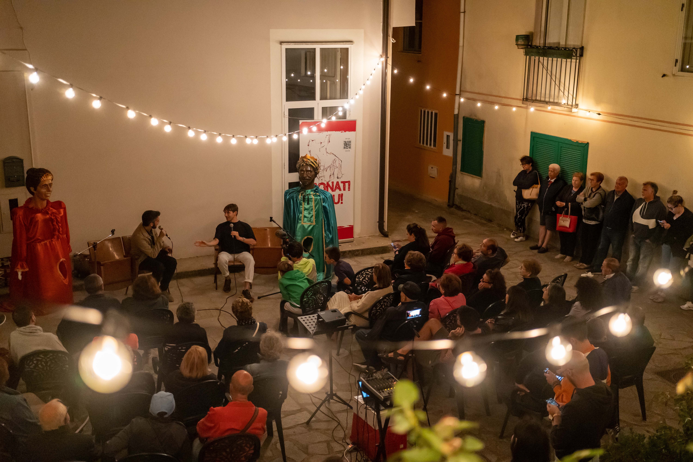

## Riflessioni da Sonati Vicinu 2023

La settima edizione del festival [Sonati Vicinu](https://sites.google.com/view/sonativicinu/edizioni/vii-edizione-2023), tenutasi nel 2023, ha rappresentato una significativa occasione di incontro tra tradizione orale, memoria collettiva e pratiche culturali contemporanee. All’interno di questo contesto, il Cinema Sestito ha assunto un ruolo centrale, non solo come luogo fisico, ma come dispositivo narrativo capace di mediare tra passato e presente.

Il cinema di San Vito sullo Ionio, sin dalla sua fondazione, ha svolto una funzione che va oltre la semplice proiezione di film: è stato uno spazio di costruzione identitaria, di trasmissione simbolica e di aggregazione sociale. La conferenza inaugurale del festival ha offerto l’opportunità di ripercorrere le [origini](/2023/04/27/la-nascita-del-cinema-a-san-vito-un-sogno-diventato-realt/) della sala, fondata nel 1946 da [Vito Sestito](/2023/04/20/la-storia-di-vito-sestito/), e di analizzarne il ruolo nella formazione di una cultura visiva condivisa.

L’intervento ha evidenziato come il cinema abbia contribuito, nel corso dei decenni, a dare forma alle narrazioni locali, accogliendo sullo schermo storie che rispecchiavano *- o talvolta sfidavano -* l’immaginario della comunità. In questo senso, il cinema  si configura come un archivio vivente, capace di dialogare con le leggende e i racconti tramandati oralmente.

Il team di Sonati Vicinu ha documentato l’evento con grande cura, restituendo attraverso le immagini l’atmosfera della serata: la partecipazione attiva del pubblico, il valore attribuito alla memoria e il desiderio condiviso di costruire nuovi spazi per la cultura.



---

Per aggiornamenti e approfondimenti, si rimanda alle sezioni dedicate del sito. Il lascito di Vito Sestito continua a vivere attraverso le storie che il cinema ha ospitato e che, ancora oggi, ci aiutano a comprendere chi siamo e da dove veniamo.