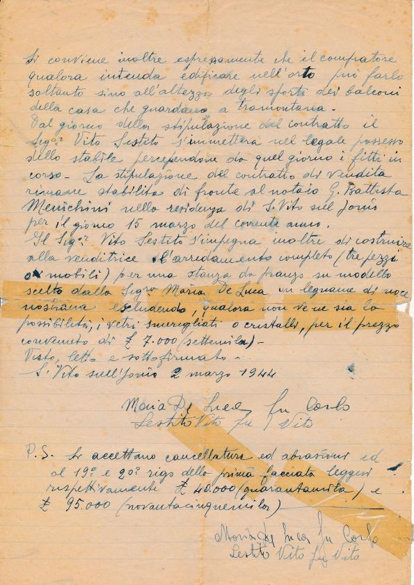
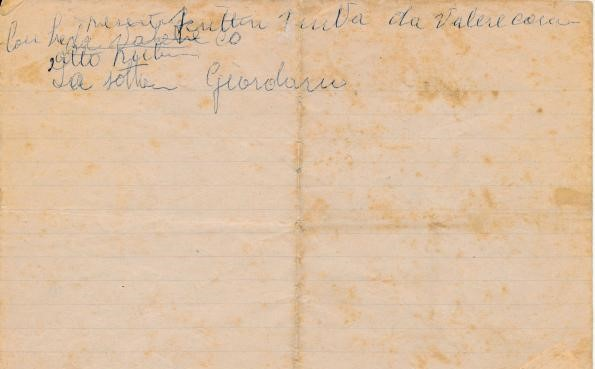
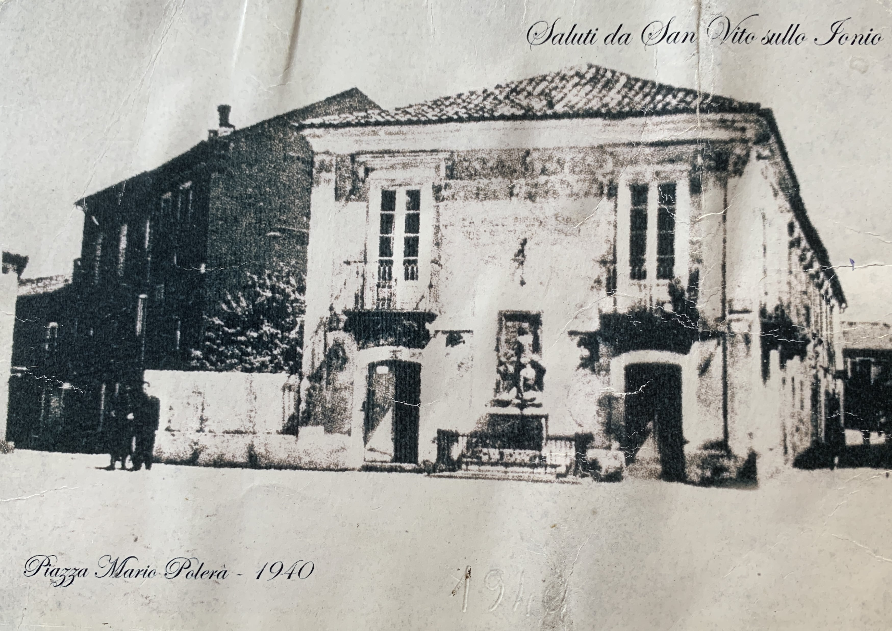

Con la presente scrittura privata da valore come a pubblico io sottoscritta Signora Maria De Luca fu Carlo prometto di vendere all’altro sottoscritto Signor Vito Sestito fu Vito una parte del mio palazzo in questo abitato di San Vito sullo Ionio in Via Umberto I e precisamente quella parte attualmente adibita ad asilo comunale ed alloggio delle suore con i relativi bassi a piano terreno, ad eccezione della prima stanza dell’alloggio delle suore confinate con il rimanente fabbricato della venditrice e la cucina attualmente in suo possesso e che corrisponde sopra il portone d’accesso alla casa venduta.

Si specifica inoltre che nella vendita andrà compreso anche il piccolo orto attaccato alla casa stessa dalla parte di tramontana e recinto di mura.

La vendita viene effettuata per il prezzo convenuto di Lire 140.000 (centoquarantamila) che il compratore si impegna di consegnare nel modo seguente:

1) L 40.000 (quarantamila) a titolo di caparra;
2) L 95.000 (novantacinquemila) all’atto della stipulazione del contratto di vendita e
3) L 5.000 (cinquemila) da consegnarsi allorquando lo stabile si sarà reso vacante.

D'altra parte la venditrice dichiara di cooperare per ottenere lo sfratto degli inquilini purché non vi siano condizioni di legge che ostacolino la sua volontà. La venditrice si impegna inoltre di restituire il doppio della somma corrisposta per caparra qualora non intenda addivenire alla stipulazione della vendita e nello stesso tempo per lo stesso motivo il compratore dichiara di perdere la sopraccitata somma del caparra.

Si conviene inoltre espressamente che il compratore qualora intenda edificare nell’orto può farlo soltanto sino all’altezza degli … dei balconi della casa che guardano a tramontana.

Dal giorno della stipulazione del contratto il Signor Vito Sestito si immetterà nel legale possesso dello stabile percependone da quel giorno i fitti in corso. La stipulazione del contratto di vendita rimane stabilita di fronte al notaio G. Battista Menichini nella residenza di San Vito sullo Ionio per il giorno 15 marzo del corrente anno.

Il Signor Vito Sestito si impegna inoltre di costruire alla venditrice l’arredamento completo (tre pezzi o mobili) per una stanza da pranzo su modello scelto dalla Signora Maria De Luca in legname di noce … escludendo, qualora non ve ne sia la possibilità, i vetri smerigliati o cristalli, per il prezzo convenuto di £ 7.000 (settemila).

Visto, letto e sottoscritto.

San Vito sullo Ionio 2 marzo 1944

Maria De Luca fu Carlo  
Sestito Vito fu Vito

P.S. Si accettano cancellature ed abrasioni ed al 19° e 20° rigo della prima facciata leggesi rispettivamente £. 40.000 (quarantamila) e £ 95.000 (novantacinquemila).

Foto del palazzo nella sua versione originale
