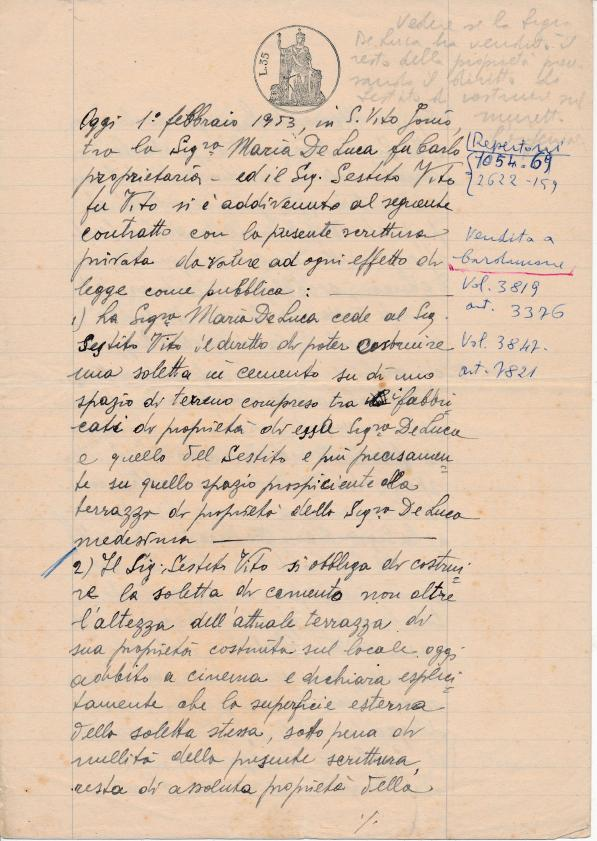
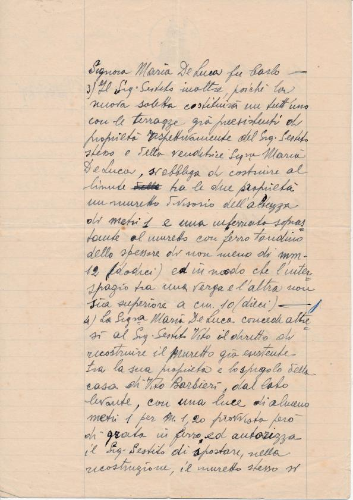

Oggi 1° febbraio 1953, in S. Vito Ionio tra la Signora Maria De Luca fu Carlo proprietaria, ed il Sig. Sestito Vito fu Vito si è addivenuto al seguente contratto con la presente scrittura privata da valore ad ogni effetto di legge come pubblica:
1) La Signora Maria De Luca cede al Sig. Sestito Vito il diritto di poter costruire una saletta in cemento su di uno spazio di terreno compreso tra i fabbricati di proprietà di essa Signora De Luca e quello del Sestito e più precisamente su quello spazio prospiciente alla terrazza di proprietà della Signora De Luca medesima.
2) Il Sig. Sestito Vito si obbliga di costruire la saletta di cemento non oltre l’altezza dell’attuale terrazza di sua proprietà costruita sul locale oggi adibito a cinema e dichiara esplicitamente che la superficie esterna della saletta stessa, sotto pena di nullità della presente scrittura, resta di assoluta proprietà della Signora Maria De Luca fu Carlo.
3) Il Sig. Sestito inoltre, poiché la nuova saletta costituirà un tutt’uno con le terrazze già preesistenti di proprietà rispettivamente del Sig. Sestito stesso e della venditrice Signora Maria De Luca, si obbliga di costruire al limite tra le due proprietà un muretto divisorio dell’altezza di metri 1 e una inferriata soprastante al muretto con ferro … dello spessore di non meno di mm 12 (dodici) ed in modo che l’intero spazio tra una verga e l’altra non sia superiore a cm. 10 (dieci).
4) La Signora Maria De Luca concede altresì al Sig. Sestito Vito il diritto di ricostruire il muretto già esistente tra la sua proprietà e lo spigolo della casa di Vito Barbieri, dal lato levante, con una luce di almeno metri 1 per cm 1,20 provvista però di grada in ferro ed autorizza il Sig. Sestito di spostare, nella ricostruzione, il muretto stesso si che questo resti normale al muro del magazzino di proprietà della Signora De Luca medesima.
5) La Signora De Luca Maria infine concede al Sig. Sestito Vito di poter costruire sulla superficie della terrazza dell’attuale cinema n° 3 (tre) lucernari aventi lo scopo di fare affluire aria nella sala cinematografica, a condizione che i lucernari stessi abbiano la copertura piatta e che non sporgano dalla superficie della terrazza su cui verranno costruiti più di cm. 25 (venticinque centimetri).
6) Il Sig. Sestito Vito paga per la cessione dei diritti di cui alla presente scrittura la somma di £. 80.000 (ottantamila) di cui la Signora Maria De Luca rilascia piena quietanza con la firma apposta alla presente.
Il presente atto letto, viene sottoscritto dalle parti.

Maria De Luca fu Carlo  
Sestito Vito
