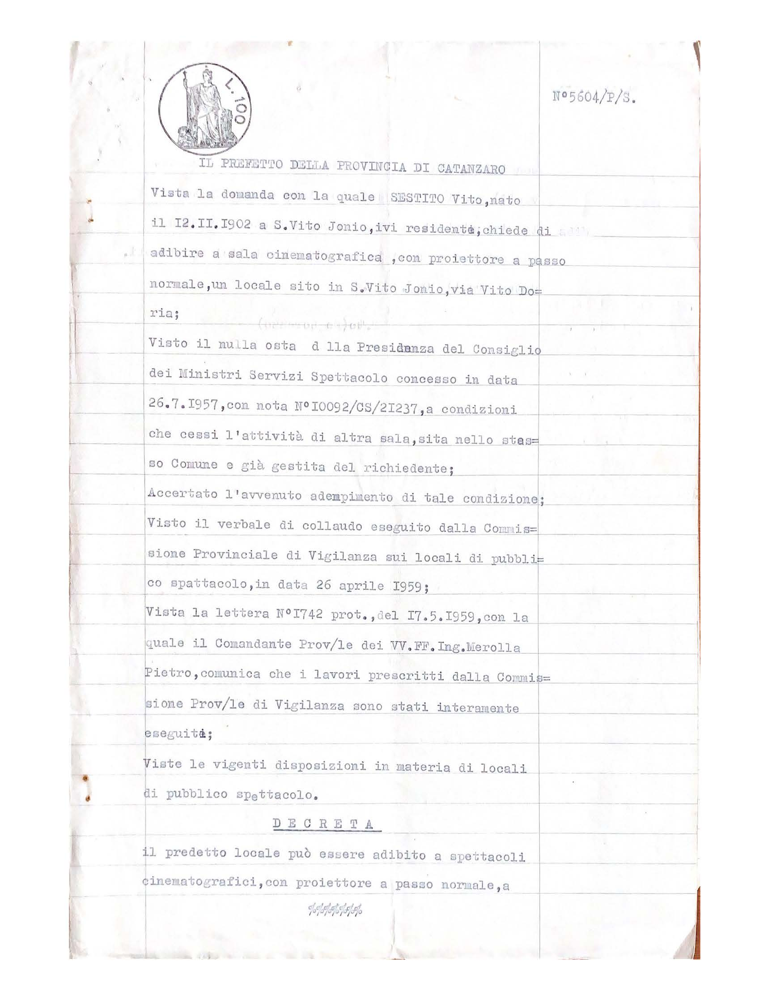
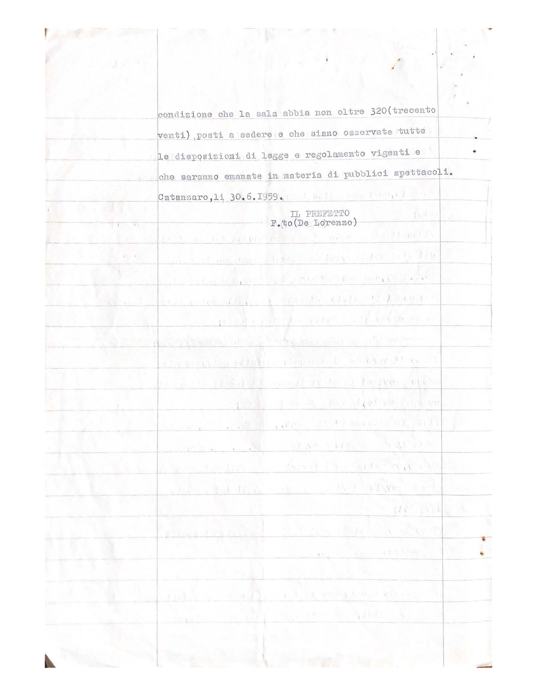

Il Prefetto della Provincia di Catanzaro

Vista la domanda con la quale Sestito Vito, nato il 12.11.1902 a S. Vito Jonio, ivi residente; chiede di adibire a sala cinematografica, con proiettore a passo normale, un locale sito in S. Vito Jonio, via Vito Doria;

Visto il nulla osta della Presidenza del Consiglio dei Ministri Servizi Spettacolo concesso in data 26.7.1957, con nota N 10092/CS/21237, a condizioni che cessi l’attività di altra sala, sita nello stesso Comune e già gestita dal richiedente;

Accertato l’avvenuto adempimento di tale condizione;

Visto il verbale di collaudo eseguito dalla Commissione Provinciale di Vigilanza sui locali di pubblico spettacolo, in data 26 aprile 1959;

Vista la lettera N 1742 prot., del 17.5.1959, con la quale il Comandante Prov/le dei VV.FF. Ing. Merolla Pietro, comunica che i lavori prescritti della Commissione Prov/le di vigilanza sono stati interamente eseguiti;

Vista le vigenti disposizioni in materia di locali di pubblico spettacolo.

Decreta il predetto locale può essere adibito a spettacoli cinematografici, con proiezione a passo normale, a condizione che la sala abbia non oltre 320 (trecento venti), posti a sedere e che siano osservate tutte le disposizioni di legge e regolamento vigenti e che saranno emanate in materia di pubblici spettacoli.

Catanzaro, li 30.6.1959

Il Prefetto De Lorenzo