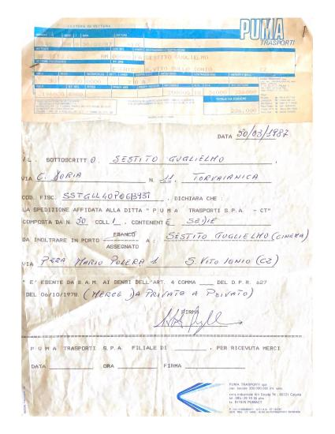

...  
La spedizione affidata alla ditta “Puma Trasporti Spa - CT” composta da N. 30 colli, contenente **sedie** da inoltrare in porto assegnato a: Sestito Guglielmo (cinema) via P.zza Mario Polera 1, S. Vito Ionio (CZ).  
...