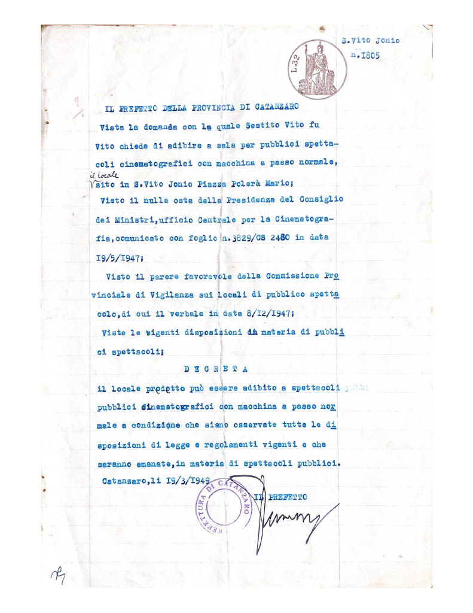

### IL PREFETTO DELLA PROVINCIA DI CATANZARO

Vista la domanda con la quale Sestito Vito fu Vito chiede di adibire a sala per pubblici spettacoli cinematografici con [macchina a passo normale](https://it.wikipedia.org/wiki/Proiettore_cinematografico), il locale sito in San Vito sullo Ionio Piazza Mario Polerà;

Visto il nulla osta della Presidenza del Consiglio dei Ministri, ufficio Centrale per la Cinematografia, comunicato con foglio n. 3829/CS 2480 in data 19/5/1947;

Visto il parere favorevole della Commissione Provinciale di Vigilanza sui locali di pubblico spettacolo, di cui il verbale in data 8/12/1947;

Viste le vigenti disposizioni in materia di pubblici spettacoli;

### DECRETA

Il locale predetto può essere adibito a spettacoli pubblici cinematografici con macchina a passo normale a condizione che siano osservate tutte le disposizioni di legge e regolamenti vigenti a che saranno emanate, in materia di spettacoli pubblici.

Catanzaro, li 19/3/1949.

Il Prefetto.

