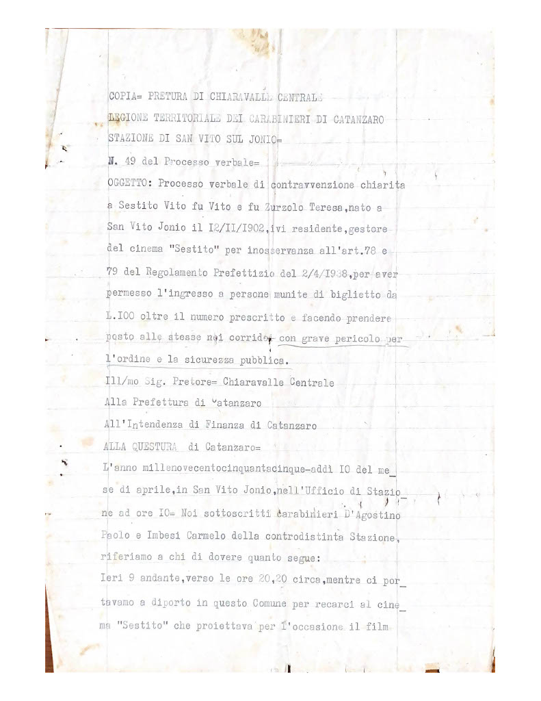
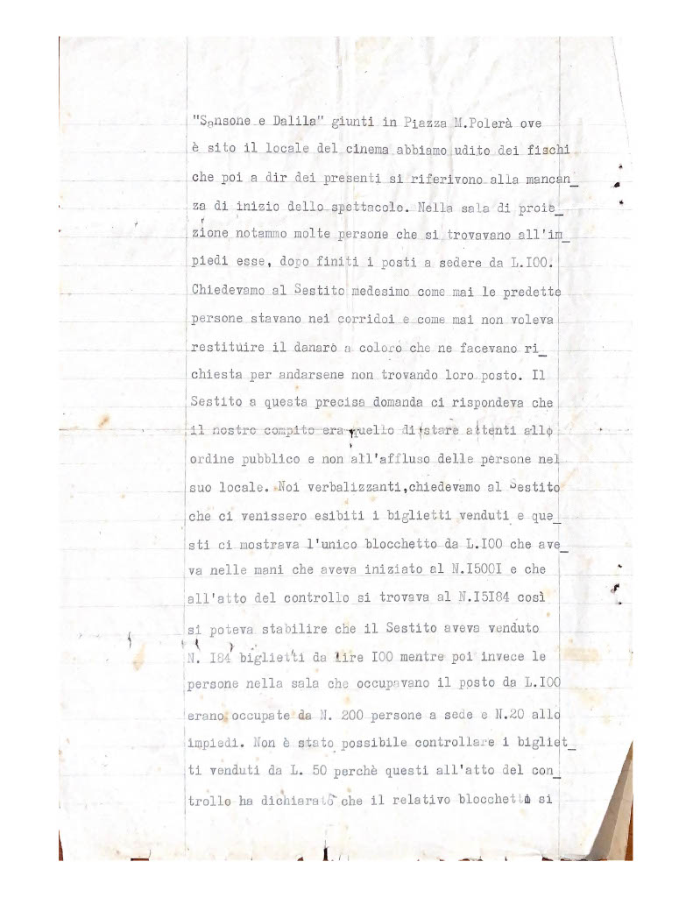
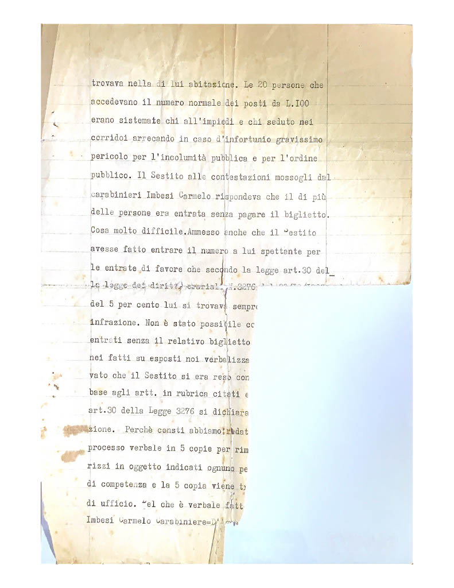
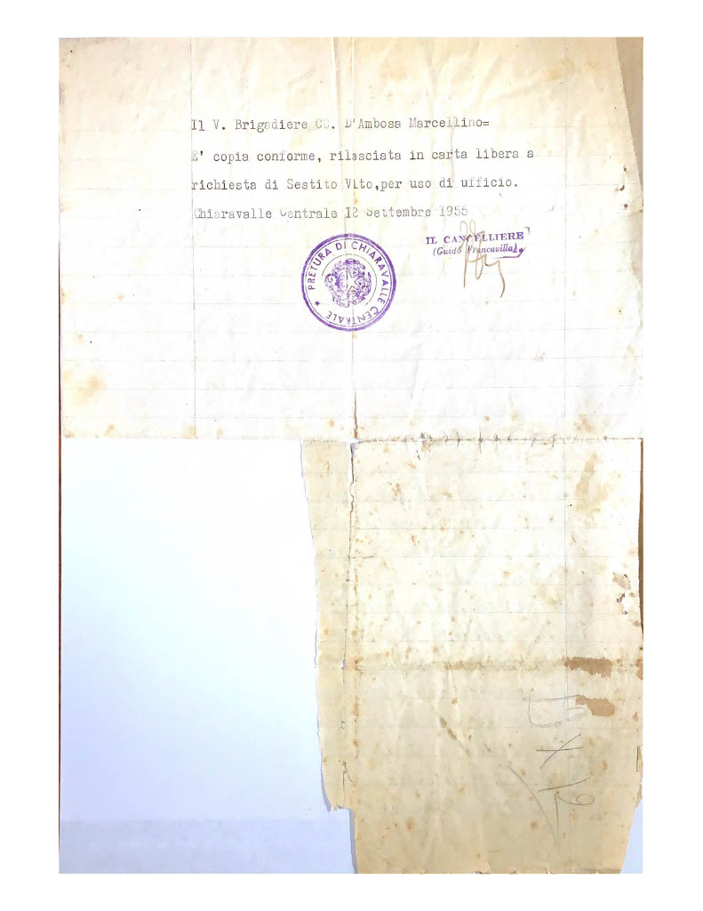

Legione Territoriale dei Carabinieri di Catanzaro Stazione di San Vito sullo Ionio.

N.49 del Processo verbale.

Oggetto: Processo verbale di contravvenzione chiarita a Sestito Vito fu Vito e fu Zurzolo Teresa, nato a San Vito Jonio il 12/11/1902, ivi residente, gestore del cinema “Sestito” per inosservanza all’art. 78 e 79 del Regolamento Prefettizio del 2/4/1938, per aver permesso l’ingresso a persone munite di biglietto da L. 100 oltre il numero prescritto e facendo prendere posto alle stesse nei corridoi con grave pericolo per l’ordine e la sicurezza pubblica.

Ill/mo Sig. Pretore Chiaravalle Centrale
Alla Prefettura di Catanzaro
All’Intendenza di Finanza di Catanzaro
Alla questura di Catanzaro

L’anno mille novecento cinquantacinque (1955) addì 10 del mese di aprile, in San Vito Jonio, nell’Ufficio di Stazione ad ore 10. Noi sottoscritti carabinieri D’agostino Paolo e Imbesi Carmelo della contro distinta Stazione, riferiamo a chi di dovere quanto segue:

Ieri 9 andante, verso le ore 20,20 circa, mentre ci portavamo a diporto in questo Comune per recarci al cinema “Sestito” che proiettava per l’occasione il film “Sansone e Dalida”  giunti in Piazza Mario Polerà ove è sito il locale del cinema abbiamo udito dei fischi che poi a dir dei presenti si riferivano alla mancanza di inizio dello spettacolo. Nella sala di proiezione notammo molte persone che si trovavano in piedi esse, dopo finiti i posti a sedere da L. 100. Chiedevamo al Sestito medesimo come mai le predette persone stavano nei corridoi e come mai non voleva restituire il danaro a coloro che ne facevano richiesta per andarsene non trovando loro posto. Il Sestito a questa precisa domanda ci rispondeva che il nostro compito era quello di stare attenti allo ordine pubblico e non all’afflusso delle persone nel suo locale. Noi verbalizzanti, chiedevamo al Sestito che ci venissero esibiti i biglietti venduti e questi ci mostrava l’unico blocchetto da L. 100 che ava nelle mani che aveva iniziato al N. 15001 e che all’atto del controllo si trovava al N. 15184 così si poteva stabilire che il Sestito aveva venduto N. 184 biglietti da Lire 100 mentre poi invece le persone nella sala che occupavano il posto da L. 100 erano occupate da N. 200 persone a sede e N. 20 in piedi. Non è stato possibile controllare i biglietti venduti da L. 50 perché questi all’atto del controllo ha dichiarato che il relativo blocchetto si trovava nella di lui abitazione. Le 20 persone che accedevano il numero normale dei posti da L. 100 erano sistemate chi in piedi e chi seduto nei corridoi arrecando in caso d’infortunio gravissimo pericolo per l’incolumità pubblica e per l’ordine pubblico. Il Sestito alle contestazioni mossogli dal carabiniere Imbesi Carmelo rispondeva che il di più delle persone era entrata senza pagare il biglietto. Cosa molto difficile. Ammesso anche che il Sestito avesse fatto entrare il numero a lui spettante per le entrate di favore che secondo la legge art. 30 della legge dei diritti erariali N. 3276 ... 

... del 5 per cento lui si trovava sempre ... infrazione. Non è stato possibile co... entrati senza il relativo biglietto ... nei fatti su esposti noi verbalizza… vato che il Sestito si era reso con… base agli artt. In rubrica citati e ... art. 30 della Legge 3276 si dichiara… zione. Perché consti abbiamo redat… processo verbale in 5 copie per rim... rizzi in oggetto indicati ognuno pe… di competenza e la 5 copia viene t... di ufficio. Che è verbale fatt... Imbesi Carmelo Carabiniere ... Il V. Brigadiere CC. D’Ambrosa Marcellino.

È copia conforme, rilasciata in carta a richiesta di Sestito Vito, per uso di ufficio.

Chiaravalle Centrale 12 Settembre 1955.

Il Cancelliere (Guido Francavilla)

