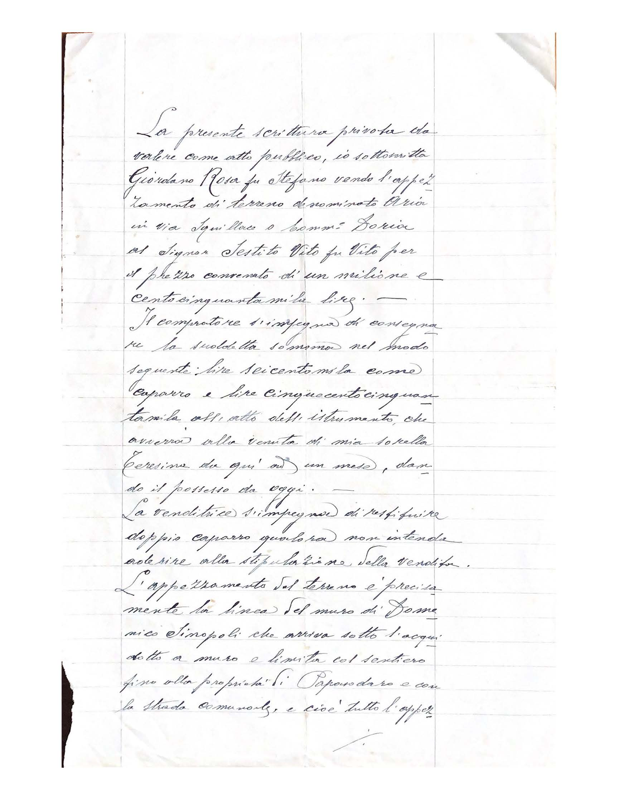
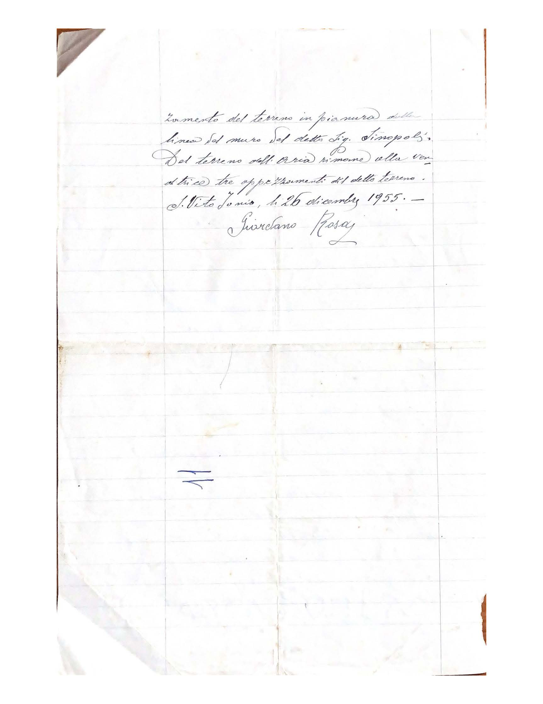

[Seconda parte](/1956/03/01/acquisto-terreno-cinema-in-via-comm-doria-parte-2/)

La presente scrittura privata da valore come atto Pubblico, io sottoscritta Giordano Rosa fu Stefano vendo l’appezzamento di terreno denominato Aria in via Squillace a Comm. Doria al Signor Sestito Vito fu Vito per il prezzo convenuto di un milione e centocinquantamila lire (1'150'000 L.).

Il compratore si impegna di consegnare la suddetta somma nel modo seguente: lire seicentomila (600'000 L.) come caparra e lire cinquecento cinquantamila (550'000 L.) all’atto dell’istrumento che avverrà alla venuta di mia sorella Teresina da qui ad un mese, dando il possesso da oggi.
La venditrice s’impegna di restituire doppia caparra qualora non intenda aderire alla stipulazione della vendita.

L’appezzamento del terreno è precisamente la linea del muro di Domenico Sinopoli che arriva sotto l’acquedotto a muro e limita col sentiero fisso alla proprietà di Papasodaro e con la strada comunale, e cioè tutto l’appezzamento del terreno in pianura dalla linea del muro del detto Sig. Sinopoli.

Del terreno dell’Aria rimane alla venditrice tre appezzamenti del detto terreno.

S. Vito Jonio, li 26 dicembre 1955.

Giordano Rosa.

