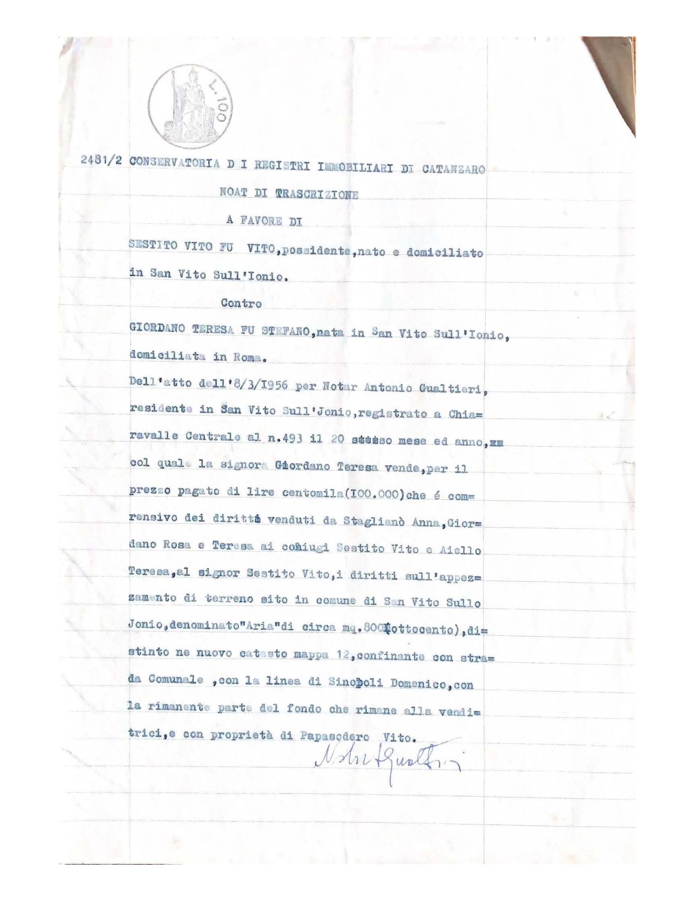
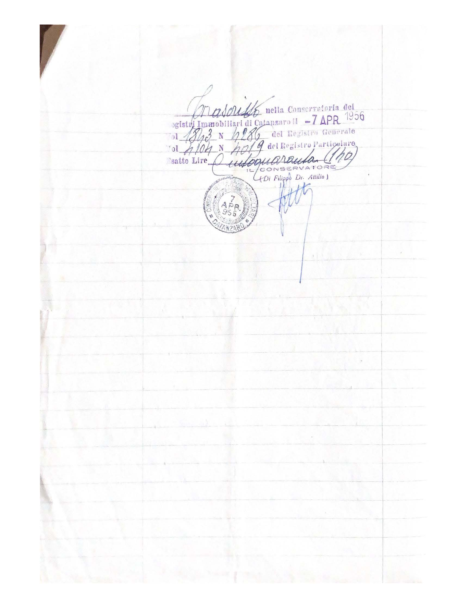

[Acquisto terreno cinema in Via Comm. Doria](/1955/12/26/acquisto-terreno-cinema-in-via-comm-doria/)

2481/2 Conservatoria dei Registri Immobiliari di Catanzaro

Nota di Trascrizione a favore di Sestito Vito fu Vito, possidente, nato e domiciliato in San Vito sull’Ionio.

Contro

Giordano Teresa fu Stefano, nata in San Vito sull’Ionio, dimiciliata in Roma.

Dell’atto dell’8/3/1956 per Notar Antonio Gualtieri, residente in San Vito sull’Jonio, registrato a Chiaravalle Centrale al n. 493 il 20 stesso mese ed anno, col quale la signora Giordano Teresa vende, per il prezzo pagato di lire centomila (100'000) che è comprensivo dei diritti venduti da Staglianò Anna, Giordano Rosa e Teresa ai coniugi Sestito Vito e Aiello Teresa, al signor Sestito Vito, i diritti sull’appezzamento di terreno sito in comune di San Vito sullo Jonio, denominato “Aria” di circa mq. 800 (ottocento), distinto ne nuovo catasto mappa 12, confinante con strada Comunale, con la linea di Sinopoli Domenico, con la rimanente parte del fondo che rimane alle venditrici, e con proprietà di Papasodero Vito.

Trascritta nella Conservatoria del Registro degli Immobilidi Catanzaro il 7 Aprile 1956 volume 1843 numero 4286 del Registro Generale e volume 4104 numero 4019 del Registro Particolare. Esatte Lire centoquaranta (140).

Il Conservatore (Di Filippo, Dt. Attilio)

