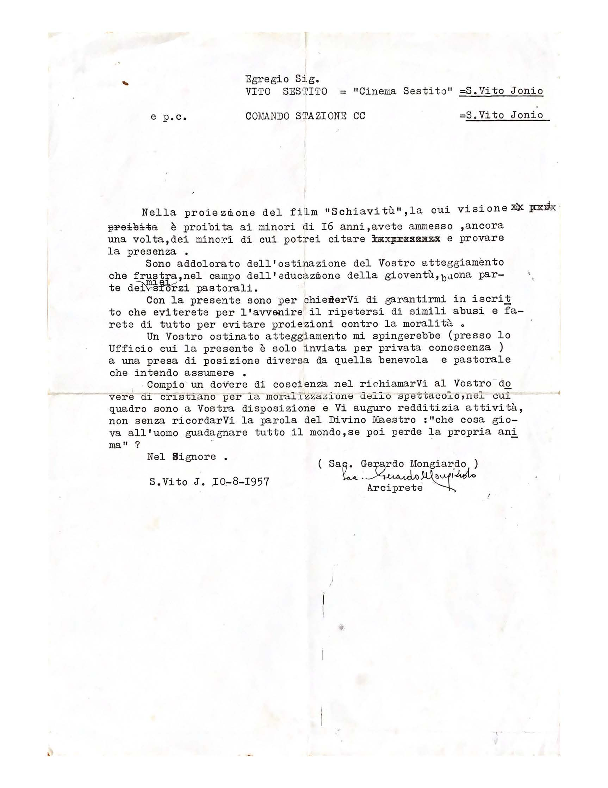

Egregio Sig. Vito Sestito “Cinema Sestito” S. Vito Jonio

e.p.c. Comando Stazione CC S. Vito Jonio

Nella proiezione del film “Schiavitù” , la cui visione è proibita ai minori di 16 anni, avete ammesso, ancora una volta, dei minori di cui potrei citare e provare la presenza.

Sono addolorato dall’ostinazione del Vostro atteggiamento che frustra, nel campo dell’educazione della gioventù, buona parte dei miei sforzi pastorali.

Con la presente sono per chiederVi di garantirmi per iscritto che eviterete per l’avvenire il ripetersi di simili abusi e fare di tutto per evitare proiezioni contro la moralità.

Un Vostro ostinato atteggiamento mi spingerebbe (presso lo Ufficio cui la presente è solo inviata per privata conoscenza) a una presa di posizione diversa da quella benevola e pastorale che intendo assumere.

Compio un dovere di coscienza nel richiamarVi al Vostro dovere di cristiano per la moralizzazione dello spettacolo, nel cui quadro sono a Vostra disposizione e Vi auguro redditizia attività, non senza ricordarVi la parola del Divino Maestro: “che cosa giova all’uomo guadagnare tutto il mondo, se poi perde la propria anima”?

Nel Signore.

S. Vito J. 10-08-1957

Sac. Gerardo Mongiardo (Arciprete)

