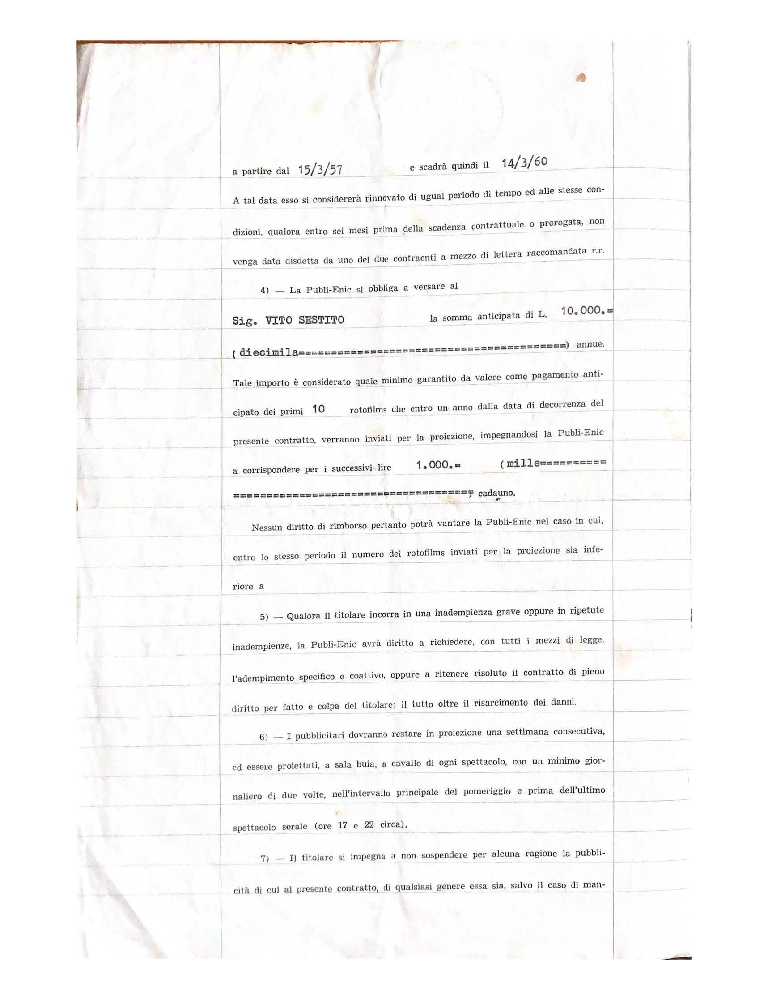
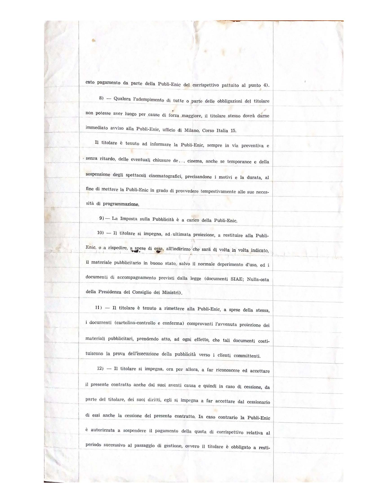
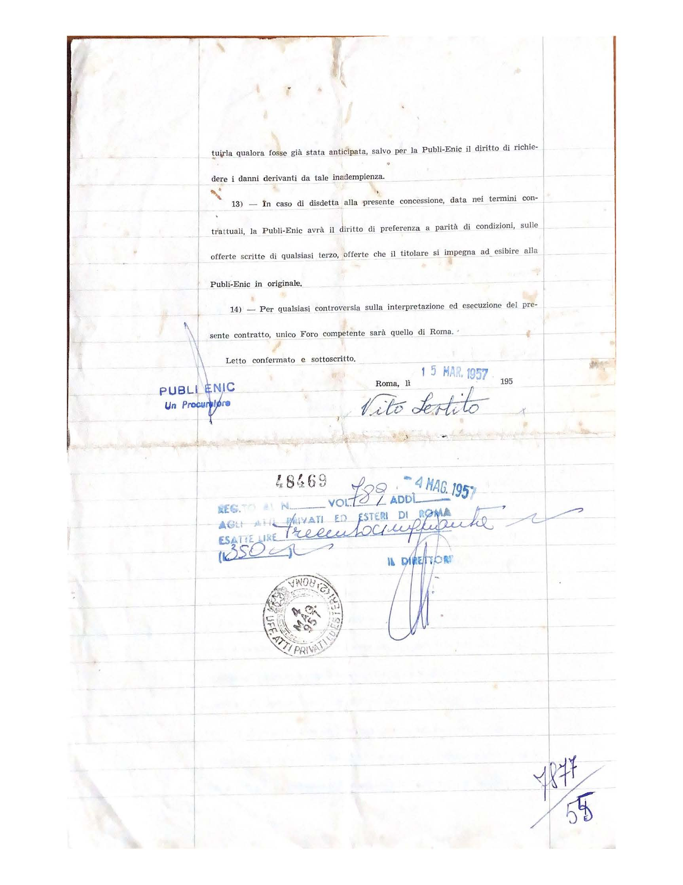

Contratto di Locazione

Cinema Sestito S. Vito Jonio (Catanzaro) rappresentata dal Sig. Vito Sestito nella sua qualità dichiarata di gestore del cinema Sestito di S. Vito Jonio ed in conseguenza titolare, in relazione al presente Contratto, dei diritti relativi all’esercizio della pubblicità cinematografica nel cinema stesso da una parte, e la Publi-Enic s.r.l. con sede in Roma – Via Savoia N. 37, in persona del suo procuratore dott. Vittorio De Vita dell’altra parte convengono:

1) Il Sig. Vito Sestito (titolare) si obbliga in esclusivo, nei confronti della Publi-Enic, che accetta, a lasciare che venga effettuato nel predetto cinema il servizio di pubblicità nelle forme previste in appresso, con diritto per la Publi0Enic di cessione a terzi parziale o totale del presente contratto nei modi di legge, e di subconcessione, parziale o totale, a terzi, dei diritti derivanti dal presente contratto.

2) Per la durata del presente contratto, e sue proroghe, il titolare si impegna a non effettuare e a non fare effettuare da terzi che non siano aventi causa della Publi-Enic, per nessun motivo, ragione o causa, la pubblicità cinematografica in qualsiasi forma e modo, pur se abbinate a film di spettacolo. Il titolare dovrà sempre informare comunque la Publi-Enic delle richieste che gli pervenissero in tal senso.
Le parti considerano elemento essenziale del contratto l’esclusività a favore della Publi-Enic pattuita nel comma precedente.

3) Il presente contratto avrà la durata di anni tre a partire dal 15/3/57 e scadrà quindi il 14/3/60. A tale data esso si considererà rinnovato di ugual periodo di tempe ed alle stesse condizioni, qualora entro sei mesi prima della scadenza contrattuale o prorogata, non venga data disdetta da uno dei due contraenti a mezzo di lettera raccomandata r.r.

4)	La Publi-Enic si obbliga a versare al Sig. Vito Sestito la somma anticipata di L/. 10'000 (diecimila) annue. Tale importo è considerato quale minio garantito da valere come pagamento anticipato dei primi 10 rotofilms che entro un anno dalla data di decorrenza del presente contratto, verranno inviati per la proiezione, impegnandosi la Publi-Enic a corrispondere per i successivi lire 1'000 (mille) cadauno.
Nessun diritto di rimborso pertanto potrà vantare la Publi-Enic nel caso in cui, entro lo stesso periodo il numero dei rotofilms inviati per la proiezione sia inferiore a ...

5)	Qualora il titolare incorra in una inadempienza grave oppure in ripetute inadempienze, la Publi-Enic avrà diritto a richiedere, con tutti i mezzi di legge, l’adempimento specifico e coattivo, oppure a ritenere risoluto il contratto di pieno diritto per fatto e colpa del titolare; il tutto oltre il risarcimento dei danni.

6)	I pubblicitari dovranno restare in proiezione una settimana consecutiva, ed essere proiettati, a sala buia, a cavallo di ogni spettacolo, con un minimo giornaliero di due volte, nell’intervallo principale del pomeriggio e prima dell’ultimo spettacolo serale (17 e 22 circa).

7)	Il titolare si impegna a non sospendere per alcuna ragione la pubblicità di cui al presente contratto, di qualsiasi genere essa sia, salvo il caso di mancato pagamento da parte della Publi-Enic del corrispettivo pattuito al punto 4).

8)	Qualora l’adempimento di tutte o parte delle obbligazioni del titolare non potesse aver luogo per cause di forza maggiore, il titolare stesso dovrà darne immediato avviso alla Publi-enic, ufficio di Milano, Corso Italia 15.
Il titolare è tenuto ad informare le Publi-Enic, sempre in via preventiva e senza ritardo, delle eventuali chiusure del cinema anche se temporanee e della sospensione degli spettacoli cinematografici, precisandone i motivi e la durata, al fine di mettere la Publi-enic in grado di provvedere tempestivamente alle sue necessità di programmazione.

9)	La Imposta sulla Pubblicità è a carico della Publi-Enic.

10)	Il titolare si impegna, ad ultima proiezione, a restituire alla Publi-Enic, o a rispedire, a spese di essa all’indirizzo che sarà di volta in volta indicato, il materiale pubblicitario in buono stato, salvo il normale deperimento d’uso, ed i documenti di accompagnamento previsti dalla legge (documenti SIAE; Nulla-osta della Presidenza del Consiglio dei Ministri).

11)	Il titolare è tenuto a rimettere alla Publi-Enic, a spese della stessa, i documenti (cartolina-controllo e conferma) comprovanti l’avvenuta proiezione dei materiali pubblicitari, prendendo atto, ad ogni effetto, che tali documenti costituiscono la prova dell’esecuzione della pubblicità verso i clienti committenti.

12)	Il titolare si impegna, ora per allora, a far riconoscere ed accettare il presente contratto anche dai suoi aventi causa e quindi in caso di cessione, da parte del titolare, dei suoi diritti, egli si impegna a far accettare dal cessionario di essi anche la cessione del presente contratto, in caso contrario la Publi-Enic è autorizzata a sospendere il pagamento della quota di corrispettivo relativa al periodo successivo al pagamento della quota di corrispettivo relativa al periodo successivo al passaggio di gestione, ovvero il titolare è obbligato a restituirla qualora fosse già stata anticipata, salvo per la Publi-enic il diritto di richiedere i danni derivanti da tale inadempienza.

13)	In caso di disdetta alla presente concessione, data ne termini contrattuali, la Publi-eic avrà il diritto di preferenza a parità di condizioni, sulle offerte scritte di qualsiasi terzo, offerte che il titolare si impegna ad esibire alla Publi-enic in originale.

14)	Per qualsiasi controversia sulla interpretazione ed esecuzione del presente contratto, unico Foro competente sarà quello di Roma.

Letto confermato e sottoscritto.

Roma, li 15 Mar. 1957

Vito Sestito

