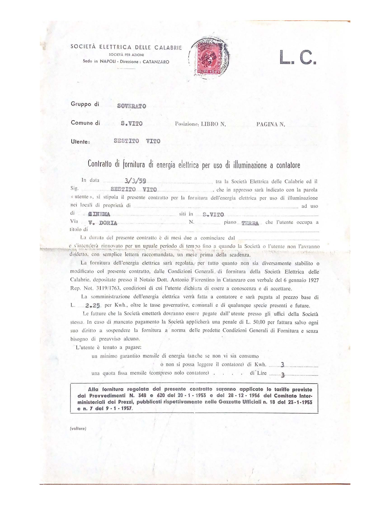
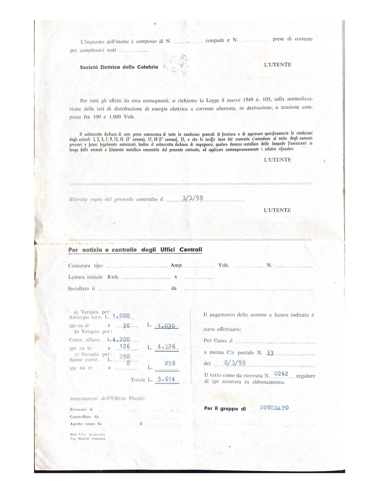
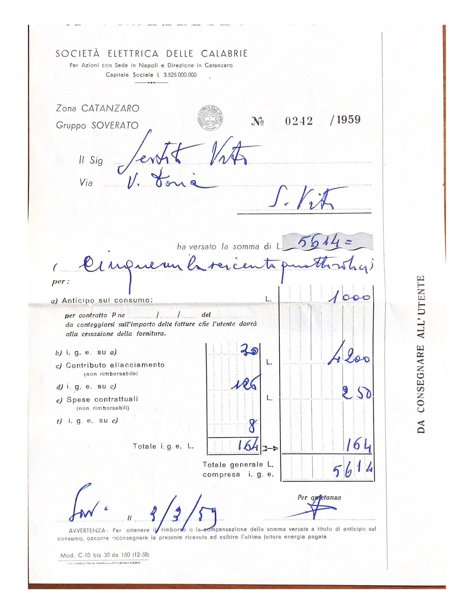
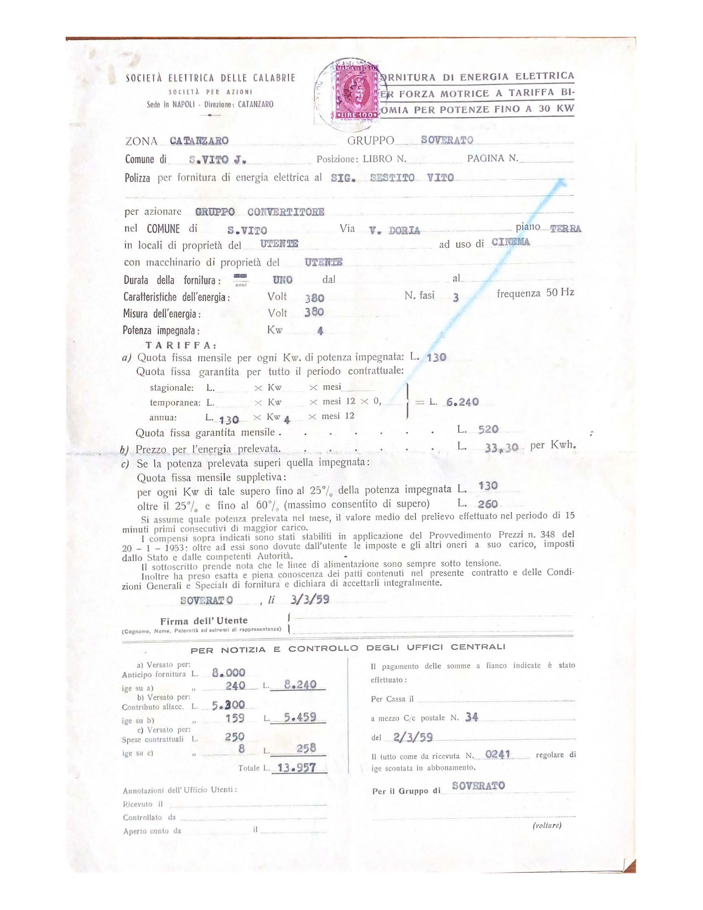
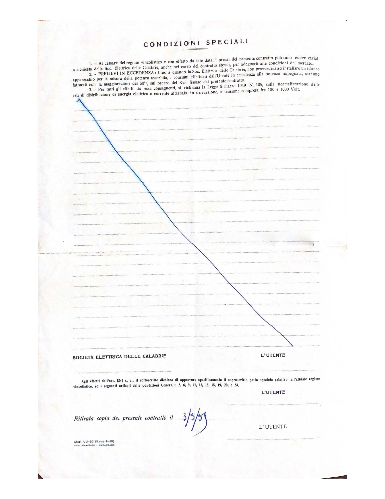
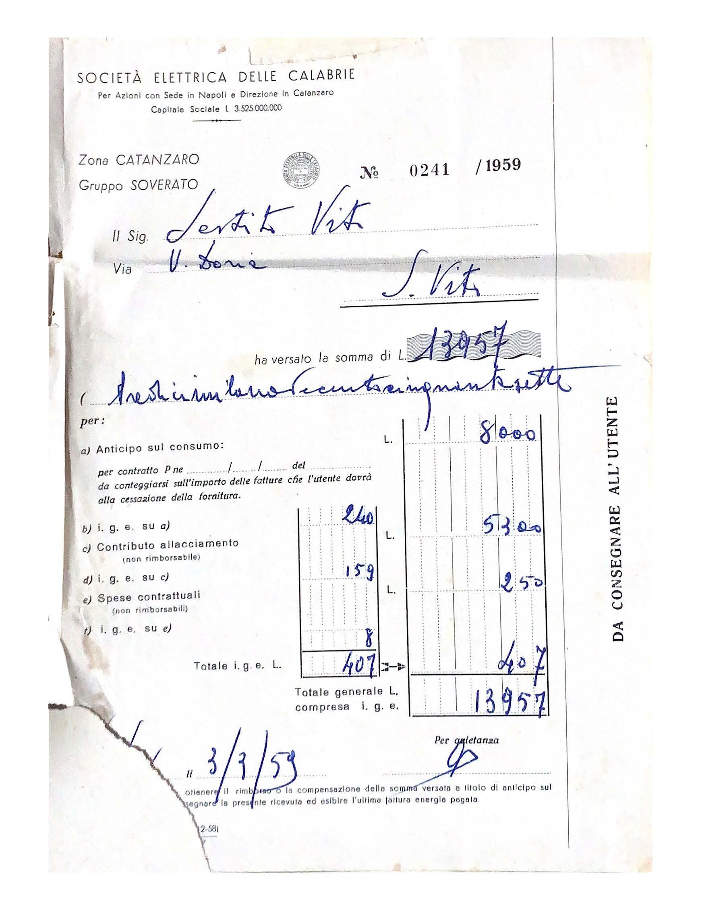

Società Elettrica delle Calabrie, Società per Azioni, Sede in Napoli – Direzione: Catanzaro.

Gruppo di Soverato, Comune di S. Vito. Utente: Sestito Vito.

Contratto di fornitura di energia elettrica per uso di illuminazione a contatore.
In data 3/3/59 tra la Società Elettrica delle Calabrie ed il Sig. Sestito Vito, che in appresso sarà indicato con la parola “utente”, si stipula il presente contratto per la fornitura dell’energia elettrica per uso di illuminazione nei locali di proprietà di … ad uso di Cinema siti in S. Vito Via V. Doria piano terra che l’utente occupa a titolo di … .

La durata del presente contratto è di mesi due a cominciare dal … e s’intenderà rinnovato per un uguale periodo di tempo fino a quando la Società o l’utente non l’avranno disdetto, con semplice lettera raccomandata, un mese prima della scadenza.

La fornitura dell’energia elettrica sarà regolata, per tutto quando non sia diversamente stabilito o modificato col presente contratto, dalle Condizioni Generali, di fornitura della Società Elettrica delle Calabrie, depositate presso il Notaio Dott. Antonio Fiorentino in Catanzaro con verbale del 6 gennaio 1927 Rep. Not. 3119/1763, condizioni di cui l’utente dichiara di essere a conoscenza e di accettare.

La somministrazione dell’energia elettrica verrà fatta a contatore e sarà pagata al prezzo base di L. 2.25 per Kwh., oltre le tasse governative, comunali e di qualunque specie presenti e future.

Le fatture che la Società emetterà dovranno essere pagate dall’utente presso gli uffici della Società stessa. In caso di mancato pagamento la Società applicherà una penale di L. 50’00 per fattura salvo ogni suo diritto a sospendere la fornitura a norma delle predette Condizioni Generali di Fornitura e senza bisogno di preavviso alcuno.

L’utente è tenuto a pagare: un minimo garantito mensile di energia (anche se non vi sia consumo o non si possa leggere il contatore) di Kwh. 3 una quota fissa mensile (compreso nel contatore) di Lire 3.

Alla fornitura regolata dal presente contratto saranno applicate le tariffe previste dai Provvedimenti N. 348 e 620 del 20-1-1953 e del 28-12-1956 del Comitato Interministeriali dei Prezzi, pubblicati rispettivamente nelle Gazzette Ufficiali n. 18 del 23-1-1953 e n. 7 del 9-1-1957.

L’impianto dell’utente è composto di N. … lampade e N. … prese di corrente per complessivi watt … .

Per tutti gli effetti da essa conseguiti, si richiama la Legge 8 marzo 1949 n. 105, sulla normalizzazione delle reti di distribuzione di energia elettrica a corrente alternata, in derivazione, a tensione compresa fra 100 e 1'000 Volt.

Il sottoscritto dichiara di aver preso conoscenza di tutte le condizioni generali di fornitura e di approvare specificamente le condizioni degli articoli 1, 2, 5, 7, 9, 15, 16 (3° comma), 17, 18 (1° comma), 21, e che le tariffe base del contratto s’intendono al netto degli aumenti presenti e futuri legalmente autorizzati. Inoltre il sottoscritto dichiara di impegnarsi, qualora dovesse installare delle lampade fluorescenti in luogo delle normali a filamento metallico consentite dal presente contratto, ad applicare contemporaneamente i relativi rifasatori.

Soverato, 3/3/59.

