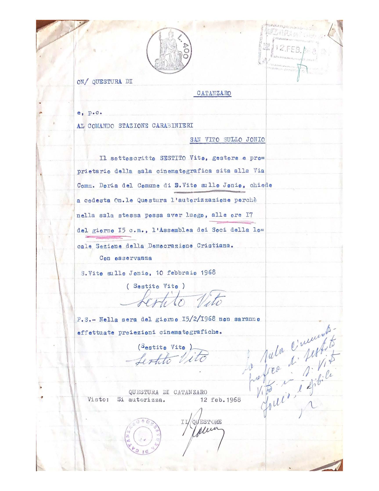

On/Questura di Catanzaro e.p.c. al Comando Stazione Carabinieri di San Vito sullo Jonio

Il sottoscritto Sestito Vito, gestore e proprietario della sala cinematografica sita alla Via Comm. Doria del Comune di [S. vito sullo Jonio](), chiede a codesta On.le Questura l’autorizzazione perché nella sala stessa possa aver luogo, [alle ore 17 del giorno 15 c.m.](), l’Assemblea dei Soci della locale Sezione della Democrazia Cristiana.

Con osservanza

S. Vito sullo Jonio, 10 febbraio 1968 (Sestito vito)

P.S. Nella sera del giorno 15/2/1968 non saranno effettuate proiezioni cinematografiche.

Questura di Catanzaro Visto; Si autorizza. 12 feb. 1968 Il Questore

