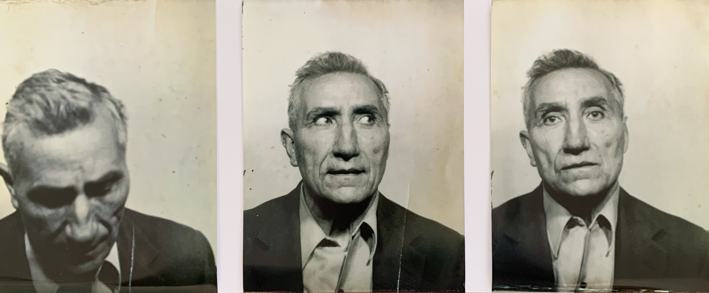
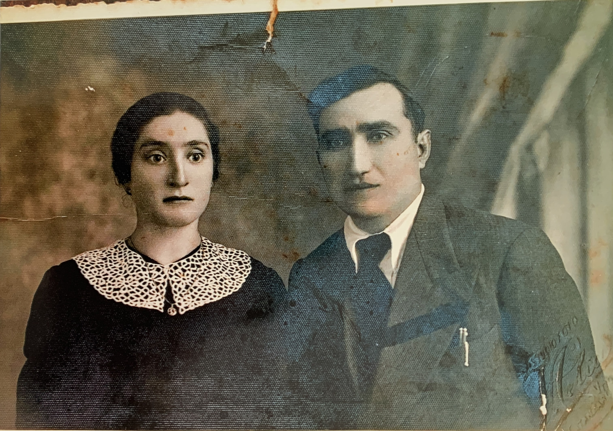
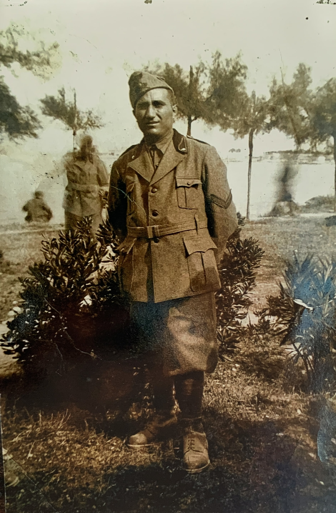

***
*Articolo in costruzione*
***
Vito Sestito nacque a San Vito sullo Ionio, un piccolo paese del sud Italia, il 12 novembre 1902, ultimo di cinque figli di Vito Sestito e xxx. Anche se gran parte della sua infanzia rimane un mistero, la famiglia di Vito sapeva che aveva un talento per lavorare il legno fin da giovane. Dopo aver completato la sua istruzione fino alla terza elementare[^1], ha iniziato a lavorare come falegname, perfezionando la sua arte e costruendo mobili per le persone della sua comunità.

Il 24 gennaio del 1931 si sposa con Maria Vitro, ma la tragedia colpì Vito quando la moglie morì durante il concepimento del loro primo figlio. Entrambi persero la vita, lasciando Vito da solo. Rimase in lutto per 10 anni prima che il fratello Vincenzo lo convincesse a sposarsi di nuovo. Fu così che nel 1939 Vito si risposò con Teresa Aiello, la sorella della moglie di Vincenzo.

Poco dopo il matrimonio scoppia la Seconda Guerra Mondiale e Vito fu arruolato nell'esercito italiano.Fu mandato in Libia, dove nonostante il pericolo e l'incertezza della guerra, Vito fu in grado di tornare a casa due volte per visitare la sua famiglia[^2]. Tuttavia, dopo che l'Italia perse la guerra, Vito dovette fare un viaggio pericoloso a piedi dalla Sicilia.

Quando Vito tornò a San Vito sullo Ionio, era determinato ad aiutare la sua comunità a riprendersi dalla devastazione della guerra. Riaprì la falegnameria e iniziò a lavorare sulla ricostruzione dei mobili e delle finestre danneggiati dalla guerra in tutta la zona.

Per pura coincidenza Vito prestò i suoi servizi di falegname per conto del proprietario del cinema Masceri a Catanzaro, che lo assunse per sistemare i mobili e l'arredamento del cinema. Questa esperienza diede a Vito l'idea di costruire un cinema nel suo paese. Il cinema di Vito divenne un luogo di ritrovo popolare per persone di tutte le età a San Vito sullo Ionio e nei paesi vicini, fornendo loro un luogo dove rilassarsi e godersi i film.

Per un po' di tempo, continuò a lavorare come falegname mentre gestiva il cinema. Tuttavia, negli ultimi anni, Vito contrasse un'allergia al legno e fu costretto a smettere di lavorare come falegname.

Fu durante questo periodo che Vito avviò una nuova attività di vendita di pezzi di ricambio per ciclo e motociclo e successivamente per auto. Il suo negozio aprì il primo di agosto del 1961. Anche se a quel tempo circolavano poche automobili in paese, il negozio con l’aumentare delle vetture in circolazione ebbe successo.

La dedizione di Vito ai suoi business non vacillò mai e continuò a lavorare sul cinema e sul negozio di pezzi di ricambio fino alla sua scomparsa nel 1985. Nonostante le difficoltà che ha affrontato, il lascito di Vito vive ancora a San Vito sullo Ionio, dove i suoi business rimangono una pietra angolare della cultura e della storia della città.

La storia di Vito Sestito è una testimonianza di una generazione che ha dovuto affrontare le difficoltà della guerra e della ricostruzione. La sua perseveranza e la sua determinazione sono un esempio di coraggio e di resilienza per le generazioni future.

[^1]: foto del diploma elementare
[^2]: foto delle due licenze