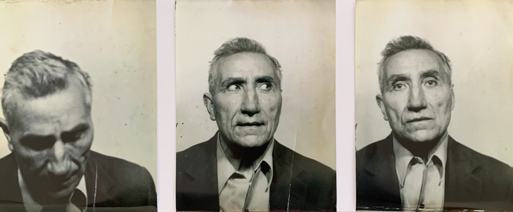
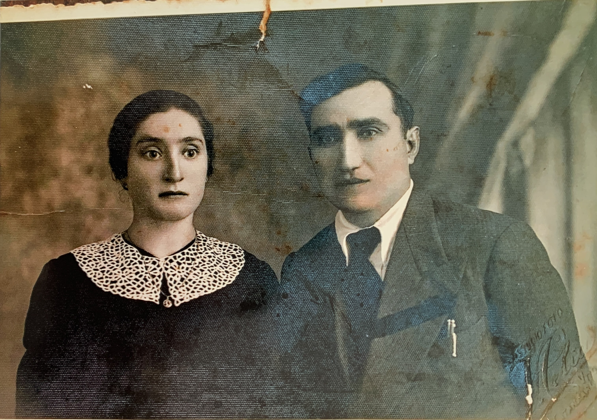
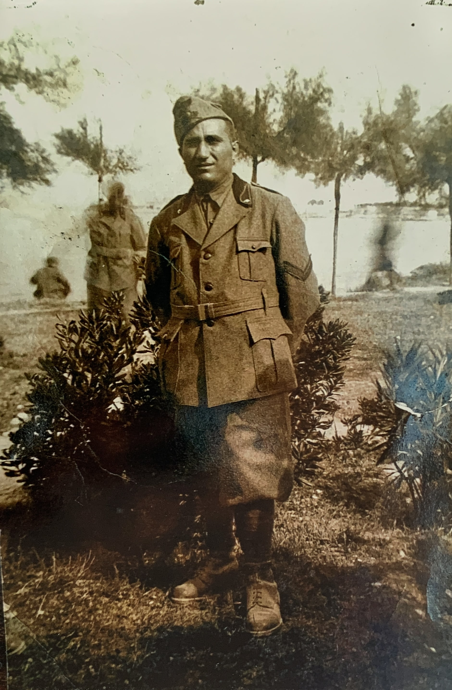

## Dalla falegnameria al cinema

Vito Sestito nacque a San Vito sullo Ionio il 12 novembre 1902. Ultimo di cinque figli, gran parte della sua infanzia rimane un mistero. Dalle poche fonti della sua infanzia sappiamo che ha completato la terza elementare, e che ad un certo punto iniziò a lavorare come falegname.

Il 24 gennaio del 1931 si sposò con Maria Vitro, ma la tragedia colpì Vito quando la moglie morì durante il concepimento del loro primo figlio. Nel 1939 Vito si risposò con Teresa Aiello.

Teresa e Vito

Poco dopo il matrimonio scoppiò la Seconda Guerra Mondiale e Vito venne arruolato nell'esercito italiano ed inviato in Libia. Dai documenti sappiamo che Vito fu in grado di tornare una volta per visitare la sua famiglia. Tuttavia, dopo che l'Italia perse la guerra, Vito dovette fare un viaggio pericoloso a piedi dalla Sicilia.

Quando Vito tornò a casa era determinato ad aiutare la sua comunità a riprendersi dalla devastazione della guerra. Riaprì la falegnameria e iniziò a lavorare sulla ricostruzione di mobili e finestre danneggiati dalla guerra.

Per pura coincidenza Vito prestò i suoi servizi di falegname per conto del proprietario del cinema Masceri a Catanzaro. Questa esperienza diede a Vito l'idea di costruire un cinema nel suo paese. Il cinema di Vito divenne un luogo di ritrovo popolare per persone di tutte le età a San Vito e nei paesi vicini, fornendo loro un luogo dove rilassarsi e godersi i film[^1].

Per un po' di tempo, continuò a lavorare come falegname mentre gestiva il cinema. Tuttavia negli ultimi anni Vito contrasse un'allergia al legno e fu costretto a smettere di lavorare come falegname.

Fu durante questo periodo che Vito avviò una nuova attività di vendita di pezzi di ricambio per ciclo e motociclo e successivamente per auto. Il suo negozio aprì il primo di agosto del 1961. Anche se a quel tempo circolavano poche automobili in paese, il negozio con l’aumentare delle vetture in circolazione ebbe successo.

La dedizione di Vito non vacillò mai e continuò a lavorare sul cinema e sul negozio di pezzi di ricambio fino alla sua scomparsa nel 1985. Nonostante le difficoltà che ha affrontato, il lascito di Vito vive ancora a San Vito. Sia il cinema che il negozio di ricambi rimangono una pietra angolare della cultura e della storia della città.

La storia di Vito Sestito è una testimonianza di una generazione che ha dovuto affrontare le difficoltà della guerra e della ricostruzione. La sua perseveranza e la sua determinazione sono un esempio di coraggio e di resilienza per le generazioni future.

[^1]: Se vuoi saperne di più sulle origini del cinema leggi questo [articolo](/2023/04/27/la-nascita-del-cinema-a-san-vito-un-sogno-diventato-realt/)