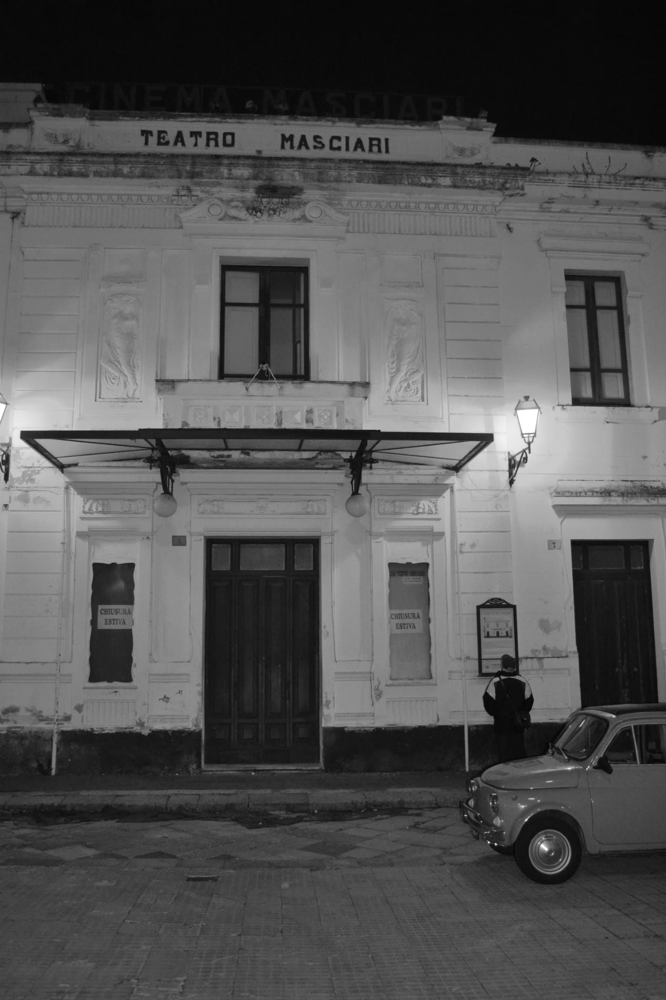
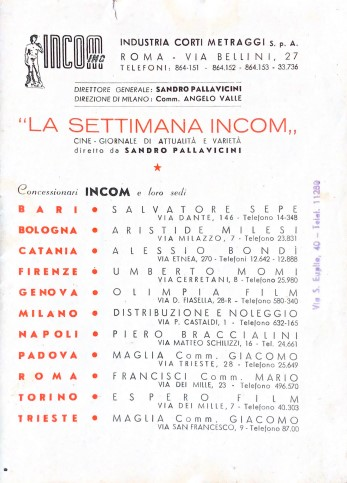

Il cinema è da sempre stato un'arte che ha catturato l'immaginazione di molte persone, e per Vito Sestito non è stato da meno. Nato e cresciuto a San Vito sullo Ionio, Vito ha sempre avuto una passione per i film e il loro potere di trasportare gli spettatori in mondi fantastici.

Fu proprio la visione dei film al cinema Masceri di Catanzaro nel 1946 che ispirò Vito ad aprire il primo cinema a San Vito.

Terminata la guerra Vito ritorna nel suo paese riprendendo il lavoro del falegname. Inizia gestendo una segheria con numerosi operai per costruire porte, finestre, balconi, mobili e bare.

In quel periodo molte famiglie di Catanzaro rifugiatesi nei paesi più piccoli ritornarono alle proprie abitazioni, trovandole danneggiate o saccheggiate. Fu così che le numerose segherie della zona iniziarono a offrire i loro servizi.

Il caso volle che Vito desse i suoi servizi ai proprietari del cinema Masceri di Catanzaro, che nel dopo lavoro invitano Vito ed i suoi operai alla proiezione serale dei film. Tornati in paese gli operai raccontavano entusiasti ciò che avevano visto al cinema. L'interesse per i film era così grande che gli operai erano disposti a lavorare gratis pur di poter vedere un film al cinema.

Deciso a rendere il cinema accessibile ai suoi concittadini, con l'aiuto della famiglia Parentela (soci del Teatro Masceri) e dei proiezionisti di Catanzaro, Vito acquistò una macchina da presa e cominciò a cercare un luogo adatto per la sua sala cinematografica. Trovò l'ideale in un terreno che aveva acquistato di recente, un orto in Piazza Mario Polerà di fianco casa sua e di sua moglie (Teresa Aiello). Insieme decisero di trasformare l’orto in un luogo di proiezione dove gli abitanti di San Vito potessero godere dei film di cui tanto avevano sentito parlare.

Per la costruzione servivano permessi del comune e dei carabinieri, che si offrirono entusiasti all’idea di creare un cinema a San Vito. All’epoca il sindaco Ferdinando Migliaccio e il comandante della caserma dei Carabinieri, il Maresciallo Volenti diedero un grosso aiuto. Parte della segheria che era sotto casa di Vito fu spostata per fare spazio all’ingresso degli spettatori, tutto l’orto fu occupato dalla cabina e dalle sedie. Inutile dire che il locale di proiezione era molto ridotto ed era suddiviso in quattro parti: ingresso, cabina di proiezione, palchetto e sala. Le sedie sono state costruite da Vito occupando tutti gli spazi, lasciando solo un corridoio centrale che andava dal palchetto degli ospiti fino al palco grande dov’era posto lo schermo. Dal cinema Masciari il proprietario Parentela inviò la macchina di proiezione e un giovane operatore (Oscar Pedullà) che si adoperò per diverso tempo per montare la macchina del cinema e istruire Vito e il fratello Vincenzo alla proiezione dei film.

Dopo aver creato la sua sala cinematografica, Vito dovette affrontare una serie di sfide burocratiche per ottenere l'abilitazione agli spettacoli pubblici. Questa arrivò il 19 marzo 1949, quando il prefetto della provincia di Catanzaro emise il decreto che autorizzava Vito a proiettare film nel suo cinema[^1].

La notizia dell’apertura del cinema a San Vito si sparse velocemente nei paesi vicini. Tutti volevano entrare nel locale, ma date le dimensioni ridotte molte persone dovettero aspettare il prossimo spettacolo. Successivamente, questi disagi furono in parte superati stabilendo un calendario d’ingresso per paese. Alcune persone venivano a piedi, altre in macchina. Il cinema per la popolazione di quei tempi era un momento di riposo dove oltre a guardare i film si mangiava e fumava.

In quegli anni ogni film era preceduto da musica con un giradischi posto nella cabina di proiezione, poi [La Settimana Incom](https://www.archivioluce.com/la-settimana-incom/) un cinegiornale settimanale di attualità, varietà e sport.

Gestire un cinema subito dopo la Seconda Guerra Mondiale in un piccolo paese come San Vito non era certo facile. Le difficoltà erano molteplici e spesso legate alla mancanza di risorse. Molte delle attrezzature e dei materiali necessari per la gestione dei cinema erano difficili da reperire o molto costosi, a causa delle difficoltà economiche del dopoguerra. Inoltre, molte innovazioni tecnologiche erano ancora in fase di sviluppo, tra cui l'audio stereo e la televisione[^2]. Ciò significava che i proprietari di cinema dovevano continuamente aggiornare le loro attrezzature per rimanere al passo con le nuove tecnologie emergenti[^3].

Uno dei problemi principali era rappresentato dalla scarsa disponibilità economica delle famiglie, che spesso non potevano permettersi il costo del biglietto. Inoltre, in alcuni casi, il cinema era utilizzato come luogo di intrattenimento e socializzazione per le conoscenze del proprietario Vito, che non pagavano l'ingresso.

Ma le difficoltà non finiscono qui. Sono stati commessi anche degli errori nella gestione del cinema, come la vendita eccessiva di biglietti rispetto alla capienza della sala, con il rischio di mettere in pericolo la sicurezza degli spettatori[^4].

Le informazioni relative al processo verbale del 1955 sono interessanti in quanto evidenziano alcune delle difficoltà e delle sfide che i gestori di cinema in piccoli paesi potevano incontrare. In particolare, sembra che Vito abbia avuto difficoltà a gestire l'afflusso di persone per la proiezione del film “Sansone e Dalida”[^5] con Hedy Lamarr e Victor Mature che aveva suscitato un grande interesse nella comunità locale. Come riferito nel processo verbale, il gestore aveva permesso l'ingresso a persone munite di biglietto da L. 100 oltre il numero consentito, facendo prendere posto alle stesse nei corridoi con grave pericolo per l'ordine e la sicurezza pubblica.

Ciò ci suggerire come Vito avesse delle difficoltà a far fronte alla domanda di intrattenimento nella comunità locale e a soddisfare le aspettative del pubblico, senza comprometterne la sicurezza e la qualità dell'esperienza cinematografica.

Inoltre, il processo verbale evidenzia anche il ruolo dei carabinieri e delle autorità locali nella vigilanza sul rispetto delle norme di sicurezza e sul mantenimento dell'ordine pubblico nei luoghi di intrattenimento come i cinema. Ciò suggerisce che i gestori di cinema in piccoli paesi dovevano fare i conti con una certa pressione da parte delle autorità locali per garantire il rispetto delle norme e la sicurezza del pubblico.

Durante il periodo del dopoguerra, i cinema divennero importanti luoghi di ritrovo per le comunità locali, oltre a essere fonti di intrattenimento. Ciò significava che i proprietari di cinema dovevano tener conto della cultura locale e delle tendenze sociali per offrire un'esperienza cinematografica soddisfacente per il pubblico.

A volte il cinema era costretto a chiudere a causa di programmi che urtavano la moralità dell'Arciprete del paese, che spesso faceva pressione su Vito e sulle forze dell’ordine locale affinché non li proiettasse. Inoltre, la chiesa del paese aveva anche un cinema che faceva concorrenza al cinema di Vito, il che rendeva ancora più difficile la sua gestione.

Ne sono una prova la lettera scritta nel 1957 dall'Arciprete Gerardo Mongiardo a Vito[^6], per lamentarsi della proiezione del film “Schiavitù”[^7], vietato ai minori di 16 anni, e dell'ammissione di minori alla visione del film. Nella lettera, l'Arciprete si dice addolorato dall'ostinazione di Vito e lo esorta a garantire per iscritto che eviterà proiezioni contro la moralità in futuro. Mongiardo avverte inoltre che un comportamento ostinato da parte di Vito potrebbe comportare una presa di posizione diversa e meno benevola nei suoi confronti.

Questa lettera mostra come la chiesa locale fosse coinvolta nella gestione del cinema e che forse avesse potere di veto sulla proiezione di alcuni film che ritenesse inappropriati. Ciò ha aggiunto ulteriori sfide per il Cinema Sestito, che doveva equilibrare le esigenze del pubblico con le aspettative dell'Arciprete e della comunità religiosa locale.

Tutto ciò fa parte delle sfide e delle difficoltà che i gestori di cinema in piccoli paesi potevano incontrare nel loro lavoro, insieme alla concorrenza di altri tipi di intrattenimento, alla necessità di investire in attrezzature e tecnologie costose, e alla difficoltà di reperire i finanziamenti necessari per mantenere in piedi la propria attività[^8].

Insomma, gestire un cinema in un piccolo paese non era affatto facile e comportava numerose difficoltà e sfide. Vito ha imparato sulla propria pelle quanto sia importante avere le giuste competenze e la giusta attenzione per far fronte alle problematiche che possono insorgere. Nonostante tutto, il cinema del paese continuò a sopravvivere, grazie alla passione e alla determinazione del suo proprietario.

Grazie alla passione e alla determinazione di Vito, il cinema nel paese divenne una realtà. La sala cinematografica di Piazza Mario Polerà sarebbe diventata un punto di riferimento per la cultura e l'intrattenimento del paese, un luogo dove gli abitanti di San Vito potevano riunirsi per godere dei film che tanto amavano. E la passione di Vito per il cinema avrebbe ispirato molte altre persone nella comunità a fare lo stesso, portando a una vera e propria nascita della cultura cinematografica a San Vito.

Il successo del cinema in Piazza portò Vito ad investire per la realizzazione di una nuova costruzione più grande un vero e proprio cinema. La storia del cinema di San Vito continua [qui]().

[^1]: Il prefetto della provincia di Catanzaro. *Abilitazione del cinema in Piazza Mario Polerà*. Catanzaro. 1949. [Link al documento](/1949/03/19/abilitazione-cinema-in-piazza-mario-poler/).
[^2]: V. Buccheri, L. Malavasi. La materia dei sogni. L'impresa cinematografica in Italia. Carocci. 2006.
[^3]: **DA FARE** articolo sull’evoluzione delle machine da presa e dei sistemi audio al cinema di San Vito.
[^4]: Legione Territoriale dei Carabinieri di Catanzaro Stazione di San Vito sullo Ionio. *N.49 del Processo verbale*. Chiaravalle Centrale. 1955. [Link al documento](/1955/09/12/processo-per-vendita-eccessiva-di-biglietti/).
[^5]: Sansone e Dalila (1949), Cecil B. DeMille. [IMDB](https://www.imdb.com/title/tt0041838/)
[^6]: Sac. Gerardo Mongiardo (Arciprete). San Vito sullo Ionio. 1957. [Link alla lettera](/1957/08/10/lettera-del-sacerdote-gerardo-mongiardo/)
[^7]: Schiavitù (1953), Yves Ciampi. [IMDB](https://www.imdb.com/title/tt0046281/)
[^8]: Nel 1959 Vito sottoscrive un contratto con la Publi-Enic Società pubblicitaria per la réclame cinematografica, permettendogli un entrata fissa stabile [Link al documento](/1958/03/15/contratto-pubblicit-publi-enic/)
