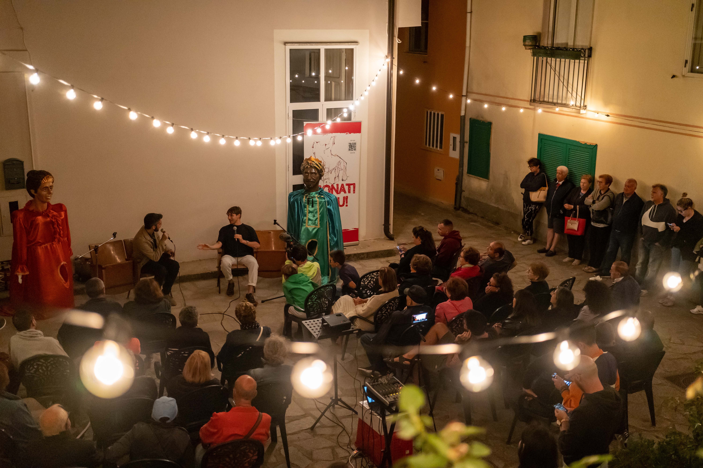

## Un Racconto da Sonati Vicinu 2023

L'incantevole festival Sonati Vicinu del 2023 è stato una celebrazione di leggende e storie, ed è stato un onore essere invitato a partecipare. La ricca storia di San Vito sullo Ionio nel narrare storie ha trovato una piattaforma unica nel nostro amato cinema. Mentre si apriva il primo giorno del festival, si è aperto il sipario su un viaggio che ha unito la magia del cinema con i racconti che hanno intrecciato la nostra comunità.

Il cinema a San Vito sullo Ionio è sempre stato più di un luogo per guardare film; è stato il nostro narratore comunitario. Mentre mi immergevo nella storia del cinema, non potevo fare a meno di riflettere su come questo iconico cinema abbia contribuito a dare vita alle storie. È qui che la nostra comunità si è riunita per vivere la magia delle narrazioni che si svelavano sul grande schermo.

La conferenza è iniziata con un viaggio nel tempo, esplorando in maniera dettagliata le origini del nostro cinema fino ad arrivare agli anni d’oro. Dai suoi esordi ad opera di Vito Sestito nel 1946 al suo ruolo fondamentale per la nostra comunità, il pubblico è stato trasportato attraverso le pagine della ricca storia del nostro cinema locale.
Ma la serata non si è conclusa nella nostalgia. Con grande entusiasmo, ho condiviso il nuovo progetto che si sta sviluppando dietro le quinte per il nostro “Nuovo” Cinema Teatro Sestito. Il nostro cinema, con la sua storica tradizione, è ora pronto a diventare un centro per molto più che semplici proiezioni. Si sta trasformando in un dinamico centro culturale, uno spazio in cui la magia del racconto, sia sullo schermo che al di fuori, può continuare a prosperare.

Il team di Sonati Vicinu è stato così gentile da documentare l'evento con foto e video, e le loro lenti hanno catturato l'essenza della serata: la passione per il cinema, il rispetto per le storie e la comunità che ci unisce.

Sonati Vicinu 2023 è stata una celebrazione di leggende, e la storia del nostro cinema si è rivelata un’aggiunta appropriata a questo intreccio. Mentre avanzo con il nuovo progetto, sono entusiasto di invitare la nostra comunità a far parte di questo nuovo capitolo, in cui la magia del racconto continua a brillare intensamente.
Continuate a seguirci sul nostro sito web per gli aggiornamenti e continuiamo a celebrare il ricco lascito di Vito Sestito e del suo cinema a San Vito sullo Ionio. Insieme, manterremo viva la fiamma delle storie per le generazioni a venire.

Foto:  


Presentazione:  
