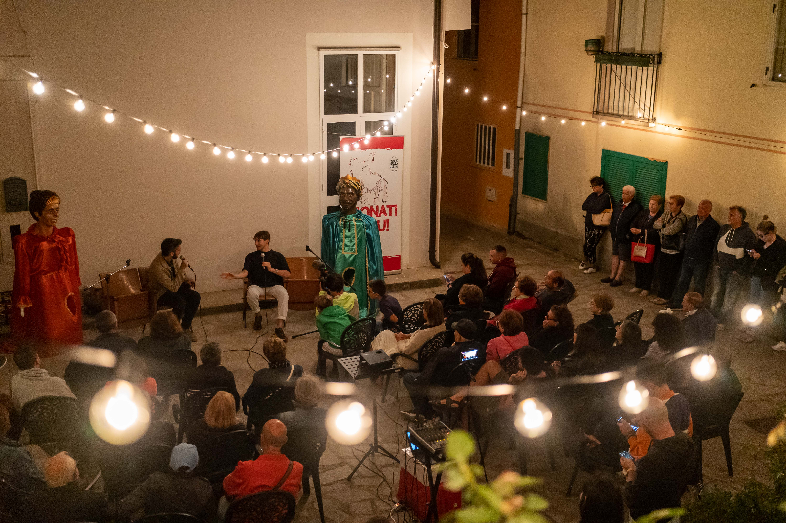

## Un Racconto da Sonati Vicinu 2023

L'incantevole festival [Sonati Vicinu](https://sites.google.com/view/sonativicinu/edizioni/vii-edizione-2023) del 2023 è stato una celebrazione di racconti e leggende, ed è stato un onore essere invitato a partecipare. La ricca tradizione di San Vito sullo Ionio nel narrare storie ha trovato una piattaforma unica nel nostro amato cinema. Mentre si apriva il primo giorno del festival, si alzava il sipario su un viaggio che ha unito la magia del cinema con le vicende che hanno intrecciato la nostra comunità.

Il cinema a San Vito sullo Ionio è sempre stato più di un luogo per guardare film; è stato il narratore comunitario del paese. Mentre mi immergevo nella sua storia, non potevo fare a meno di riflettere su come questo iconico luogo avesse contribuito a dare forma alle differenti narrazioni che la nostra comunità è accorsa, nel tempo, ad ammirare sul grande schermo.

La conferenza è iniziata con un viaggio nel passato, esplorando in maniera dettagliata le [origini](/2023/04/27/la-nascita-del-cinema-a-san-vito-un-sogno-diventato-realt/) del cinema fino ad arrivare agli anni d’oro. Dai suoi esordi ad opera di [Vito Sestito](/2023/04/20/la-storia-di-vito-sestito/) nel 1946, al suo ruolo fondamentale per la nostra comunità, il pubblico è stato coinvolto nella ricca storia del piccolo cinema locale.

Ma la serata non si è conclusa nella nostalgia; con grande entusiasmo ho condiviso il nuovo progetto che si sta sviluppando dietro le quinte per il “Nuovo” Cinema Teatro Sestito. Il cinema, con la sua storica tradizione, è ora pronto a diventare molto più che un centro per semplici proiezioni; si sta trasformando in un dinamico polo culturale, uno spazio in cui la magia del racconto, sia sullo schermo che al di fuori, può continuare a prosperare.

Il team di Sonati Vicinu è stato così gentile da documentare l'evento con alcune foto e le loro lenti hanno catturato l'essenza della serata: la passione per il cinema, il rispetto per le storie e la comunità che ci unisce.

Sonati Vicinu 2023 è stata una celebrazione di leggende e la storia del nostro cinema si è rivelata un’aggiunta appropriata a questo intreccio. Mentre avanziamo con il nuovo progetto, siamo entusiasti di invitare la comunità a far parte di questo nuovo capitolo.

Continuate a seguirci sul nostro sito web per gli aggiornamenti e continuiamo a celebrare il ricco lascito di Vito Sestito e del suo cinema a San Vito sullo Ionio. Insieme manterremo viva la fiamma delle storie per le generazioni a venire.

Foto:  


Presentazione:  
